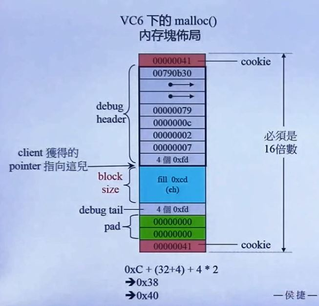
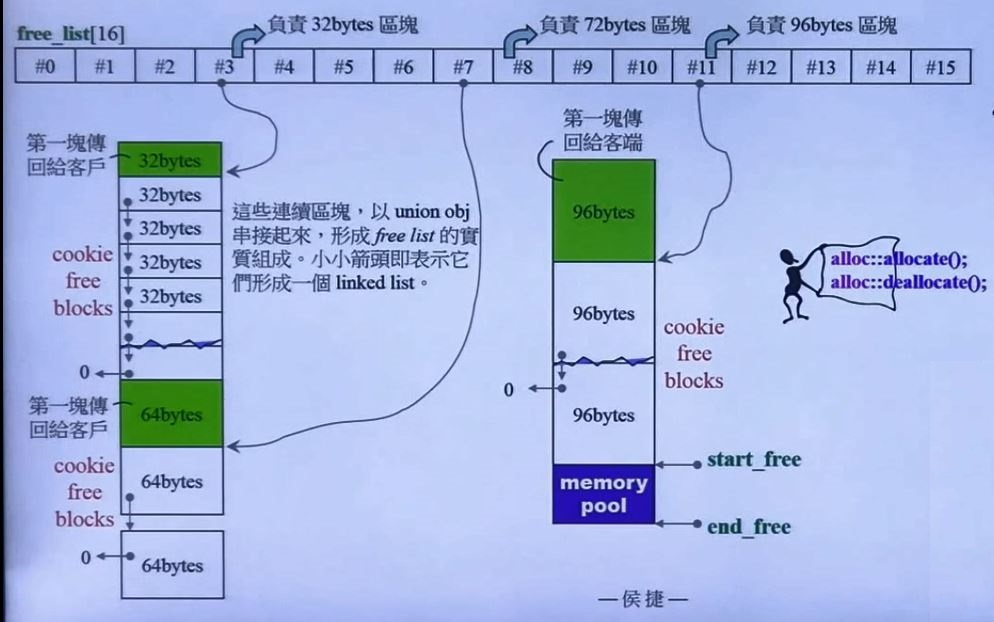

# C++内存管理

## 第二讲 std::allocator

### VC6 malloc()



### VC6 标准分配器之实现

VC6 所附的标准库，其 std::allocator 实现如下（\<xmemory\>)

```C++
#ifndef _FARQ
#define _FARQ
#define _PDFT ptrdiff_t
#define _SIZT size_t
#endif

template<class _Ty>
class allocator
{
public:
    typedef _SIZT size_type;
    typedef _PTFT difference_type;
    typedef _Ty _FQRQ *pointer;
    typedef _Ty value_type;
    pointer allocate(size_type _N, const void*)
    {
        return (_Allocate((difference_type)_N,(pointer)0));
    }
    void deallocate(void_FARQ *_p, size_type)
    {
        operator delete(_p);
    }
};
// 其中 _Allocate() 定义如下：
template<class _Ty> inline
_Ty _FARQ *_Allocate(_PDFT _N, _Ty _FARQ *)
{
    if (_N < 0) _N = 0;
    return ((_Ty _FARQ*) operator new((_SIZT)_N * sizeof(_Ty)));
}
// 分配 512 ints
int* p = allocator<int>().allocate(512,(int*)0);
allocate <int>().deallocate(p,512);
// 以元素为单位
// VC6 的 allocator 只是以 ::operator new 和 ::operator delete 完成 allocate() 和 deallocate()，没有任何特殊设计
// operator new 实质上就是 malloc
// operator delete 实质上是调用 free

// 容器中的最后一个模板参数默认都是 allocator
template <class _Ty, class _A = allocator<_Ty>>
class vector{......};

template <class _Ty, class _A = allocator<_Ty>>
class list {......};

template <class _Ty, class _A = allocator<_Ty>>
class deque {......};

template <class _K, class _Pr = less<_K>,class _A = allocator <_Ty>>
class set {......};
```

### BC5 标准分配器之实现

`<memory.stl>`

```C++
template <class T>
class allocator
{
public:
    typedef size_t size_type;
    typedef ptrdiff_t difference_type;
    typedef T* pointer;
    typedef T value_type;
    pointer allocate(size_type n, allocator<void>::const_pointer=0)
    {
        pointer tmp = _RWSTD_STATIC_CAST(pointer,(::operator new(_RWSTD_STATIC_CAST(size_t,(n*sizeof(value_type))))));
        _RWSTD_THROW_NO_MSG(tmp==0, bad_alloc);
        return tmp;
    }
    void deallocate(pointer p, size_type)
    {
        ::operator delete(p);
    }
    ......
};
// BC5的 allocator 只是以 ::operator new 和 ::operator delete 完成 allocate() 和 deallocate()，没有任何特殊设计
```

### G2.9 标准分配器之实现

`<defalloc.h>`

```C++
template <class T>
class allocator
{
public:
    typedef T value_type;
    typedef T* pointer;
    typedef size_t size_type;
    typedef ptrdiff_t difference_type;
    pointer allocate(size_type n)
    {
        return ::allocate((difference_type)n, (pointer)0);
    }
    void deallocate(pointer p) {::deallocate(p);}
};

template<class T>
inline T* allocate(ptrdiff_t size, T*)
{
    set_new_handler(0);
    T* tmp = (T*)(::operator new((size_t)(size*sizeof(T))));
    if (tmp==0)
    {
        cerr<<"out of memroy"<<endl;
        exit(1);
    }
    return tmp;
}
tmeplate <class T>
inline void deallocate(T* buffer)
{
    ::operator delete(buffer);
}
// G2.9容器使用的分配器不是 std::allocator 而是 std::alloc
// 分配 512 bytes
void*p = alloc::allocate(512);
// 或 alloc().allocate(512);
alloc::deallocate(p,512);
```

### G4.9 标准分配器之实现

```C++
#define __allocator_base __gnu_cxx::new_allocator
template<typename _Tp>
class new_allocator
{
    ......
    pointer allocate(size_type __n, const void* = 0)
    {
        if (__n>this->max_size())
            std::_throw_bad_alloc();
        return static_cast<_Tp*>(::operator new(__n*sizeof（_Tp)));
    }
    void deallocate(pointer __p, size_type)
    {
        ::operator delete(__p);
    }
    ......
};
template<typename_Tp>
class allocatlr:public__allocator_base<_Tp>
{
......
};
// G4.9 的 allocator 只是以 ::operator new 和 ::operator delete 完成 allocate() 和 deallocate()，没有任何特殊设计
```


### G2.9 std::alloc vs. G4.9 __pool_alloc

```C++
// G2.9
enum {__ALIGN=8};
enum {__MAX_BYTES = 128};
enum {__NFREELISTS = __MAX_BYTES/__ALIGN};

template<bool threads, int inst>
class __default_alloc_template 
    // typedef __default_alloc_template<false,0> alloc;
{
private:
    union obj
    {
        union obj* free_list_link;
    };
private:
    static obj* volatile free_list[__NFREELISTS];
    ......
    //Chunk allocation state
    static char* start_free;
    static char* end_free;
    static size_t heap_size;
    ......
};
// 用例
vector <string, std::alloc<string> vec;
//====================
// G 4.9
class __pool_alloc_base
{
protected:
    enum {_S_align = 8};
    enum {_S_max_bytes = 128};
    enum {_S_free_list_size = (size_t)_S_max_bytes/(size_t)_S_align};
    union _Obj
    {
        union _Obj* _M_free_list_link;
        char _M_client_data[1]; // the client sees this.
    };
    static _Obj* volatile _S_free_list[_S_free_list_size];
    // Chunk allocation state.
    static char* _S_start_free;
    static char* _S_end_free;
    static size_t _S_hap_size;
    ......
};
template <typename _Tp>
class __pool_alloc:private __pool_alloc_base
{...};
// 用例
vector<string, _gnu_cxx::__pool_alloc<strint>> vec;
```

优点：去除了 cookie，节省空间

#### G4.9 pool allocator 用例

```C++
// 欲使用 std::allocator 以外的 allocator，就得自行 #include <ext/...>
#include <ext\pool_allocator.h>
template <typename Alloc>
void cookie_test(Alloc alloc, size_t n)
{
    typename Alloc::value_type *p1, *p2, *p3;
    p1 = alloc.allocate(n);
    p2 = alloc.allocate(n);
    p3 = alloc.allocate(n);
    
    cout << "p1="<<p1<<'\t'<<"p2="<<p2<<'\t'<<"p3="<<p3<<'\n';
    alloc.deallocate(p1,sizeof(typename Alloc::value_type));
    alloc.deallocate(p2,sizeof(typename Alloc::value_type));
    alloc.deallocate(p3,sizeof(typename Alloc::value_type));
}
//----------------
cout << sizeof(__gnu_cxx::__pool_alloc<int>) << endl; // 1
vector<int, __gnu_cxx::__pool_alloc<ing>> vecPool;
cookie_test(__gnu_cxx::_pool_alloc<double>(),1);
// 相距08h，表示不带 cookie

// p1 = 0xae4138 p2 = 0xae4140 p3 = 0xae4148    
// p1 = 0xae25e8 p2 = 0xadeb50 p3 = 0xadd090
// 可能内存无法连续分配
cout << sizeof(std::allocator<int>)<<endl; // 1
vector<int, std::allocator<int>>vec;
cookie_test(std::allocator<double>(),1);
// 相距10h，表示带 cookie
// p1 = 0x3e4098 p2 = 0x3e4088 p3 = 0x3e4078
```

### G2.9 std::alloc 运行模式

使用 free_list[16] 来存储指向链表的指针

```C++
template <bool threads, int inst>
__default_alloc_template<threads, inst>::obj* volatile
__default_alloc_template<threads, inst>::free_list[__NFREELISTS]//16
//---------------------
// 令第2级分配器的名称为 alloc
typedef __default_alloc_template<false,0> alloc;
```

如果容器发出的需求小于 8 个字节，alloc 会自动调整到 8

当需要 32bytes 的区块时，由于 pool 为空，申请一块 32\*20\*2+RoundUp(0>>4) = 1280 （RoundUp 追加量将一个数字上调或下调到16的边界，0>>4 右移4，相当于除以16）的空间，从中切出一个区块返回给 client，19个区块给 list#3，剩余 640 备用。申请的一整块使用的是 malloc，只有首尾有 cookie。从 pool 中切割出来准备挂上 free list 的区块，数量永远在 1-20 之间。

申请 64 bytes，由于 pool 有余量，故 pool 划分为 640/64 = 10 个区块，第一个给 client，剩下的 9 个 挂载 list#7下。此时累计申请量 1280，pool 大小为 0。

申请 96bytes，由于 pool 无余量，故申请一块 96\*20\*2+RoundUp(1280>>4)，其中 19个区块给 list#11，1 个返回给 client，余 2000 备用。累计申请量 5200，pool大小 2000。

申请 88，由于 pool 有余量，故取 pool 分割成 20 个区块，第 1 个给 client，余 19 个挂于 list#10，pool 余量 2000-88*20=240。

申请 8，取 pool 分割 20块，19块挂于 list#0，pool 剩余 80。

申请 104，list#12无区块，pool 余量又不足供应一个，于是先将 pool 余额拨给 list#9（碎片处理），然后索取 104\*20\*2+RoundUp(5200>>4) 切出 19 个给 list#12，余2480 备用。累计申请量 9688，pool 2480。

申请 112，19个区块挂于 list#13，pool 剩余 2048-112\*20 = 168。累计申请量 9688。

申请 48，从 pool 中取 3 个区块，两个挂于 list#5，pool 剩余 168-48\*3=24。

假设内存大小为 10000，已经分配了 9688。此时申请 72，首先将 pool 剩余的拨给 list#2，此时无法满足索取 72\*20*2+RoundUp，于是 alloc 从手中资源最接近的 80 取一块回填到 pool，再切出 72 给客户。pool 余量 8。

再申请 120，无法找到满足条件的区块，无法分配空间。

可以分配的大小为 8 - 128，当需要的内存块大于128 bytes 时，会使用 malloc



#### embedded pointers

对于每一个没有分配出去的区块，以链表的形式存在。借用每一块的前4个字节作为指针，指向下一区块。一个指针 free-list 指向头部。当需要分配区块时，从头部取出空间分配给容器，free-list指向下一区块。被分配的区块的指针被容器的数据覆盖，分配给了客户。对象本身需要大于 4 个字节才能借用前 4 个字节作为指针。一般使用的小区块都大于 4 个字节。

```C++
union obj
{
    union obj* free_list_link;
    char client_data[1]; // 实际上没有被使用
};
```

