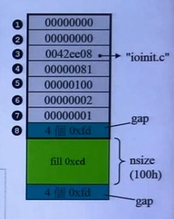

# C++内存管理

## 第三讲 malloc/free

### VC6 内存分配

```C++
// call stack	
		ExitProcess(code)
        _initterm(,,) // do terminators
            __endstdio(void)
        _initterm(,,) // do pre-terminators
      doexit(code, 0, 0)
    exit(code) // 9
    main() // 8
      _initterm(,,) // do c++ initializations
        __initstdio(void)
      _initterm(,,) // do initialization
    _cinit() // do C data initialize // 7
    _setenvp() // 6
    _setargv() // 5
    __crtGetEnvironmentStringsA() // 4
    GetCommandLineA() // 3
              __sbh_alloc_new_group(...)
              __sbh_alloc_new_region()
              __sbh_alloc_block(...) // SBH: Small Block Heap
            _heap_alloc_base(...)
          __heap_alloc_dbg(...)
        _nh_malloc_dbg(...)
      _malloc_dbg(...)
    _ioinit() // initialize lowio // 2
      __sbh_heap_init()
    _heap_init(...) // 1
    mainCRTStartup()
    KERNEL32! bff8b6e6()
  KERNEL32! bff8b598()
KERNEL32! bff89f5b()
```

```C++
// _heap_alloc_base(...)
if (size <= __sbh_threshold) // 3F8, i.e. 1016 
{
    pvReturn = _sbh_alloc_block(size); 
    // 如果比门限小，则通过该函数获取内存，为小区块服务
    if(pvReturn) return pvReturn;
}
if(size == 0) size = 1;
size = (size + ...)&~(...);
return HeapAlloc(_crtheap,0,size); // windows 函数
```

### VC10 内存分配

```C++
// call stack	
		ExitProcess(code)
        _initterm(,,) // do terminators
            __endstdio(void)
        _initterm(,,) // do pre-terminators
      doexit(code, 0, 0)
    exit(code) // 9
    main() // 8
      _initterm(,,) // do c++ initializations
        __initstdio(void)
      _initterm(,,) // do initialization
    _cinit() // do C data initialize // 7
    _setenvp() // 6
    _setargv() // 5
    __crtGetEnvironmentStringsA() // 4
    GetCommandLineA() // 3
              //__sbh_alloc_new_group(...)
              //__sbh_alloc_new_region()
              //__sbh_alloc_block(...) // SBH: Small Block Heap
            _heap_alloc_base(...)
          //__heap_alloc_dbg(...)
        _nh_malloc_dbg(...)
      _malloc_dbg(...)
    _ioinit() // initialize lowio // 2
      //__sbh_heap_init()
    _heap_init(...) // 1
    mainCRTStartup()
    KERNEL32! bff8b6e6()
  KERNEL32! bff8b598()
KERNEL32! bff89f5b()
```

```C++
// _heap_alloc_base(...)
#ifdef _DEBUG
#define _heap_alloc _heap_alloc_base
#endif 
//......
__forceinline void* __cdecl _heap_alloc (size_t size)
{
    if (_ctrheap == 0)
    {
        __FF_MSGBANNER(); /* write run-time error banner*/
        _NMSG_WRITE(_RT_CRT_NOTINIT); /* write message*/
        __crtExitProcess(255); /* normolly _exit(255)*/
    }
    return HeapAlloc(_crtheap, 0, size? size : 1); 
    // 无论什么大小都调用系统函数来分配内存
}
```

### SBH 之始——\_heap\_init() 和 \_\_sbh\_heap\_init()

```C++
int __cdecl _heap_init( int mtflag)
{
    // Initialize the "big-block" heap first.
    if ((_crtheap = HeapCreate(mtflag? 0:HEAP_NP_SERIALIZE, BYTES_PER_PAGE, 0))==NULL) // BYTES_PER_PAGE = 4096
        return 0;
    // Initialize the small-block heap
    if(__sbh_heap_init()==0)
    {
        HeapDestroy(_crtheap);
        return 0;
    }
    return 1;
}
// 不论 big-block heap 还是 small-block heap，只要失败就 return 0

//=========
int __cdecl __sbh_heap_init(void)
{
    if(!(__sbh_pHeaderList = HeapAlloc(_crtheap,0,16*sizeof(HEADER))))
        // HeapAlloc 的到的结果为指向 16 个 header 的头的指针
        return FALSE;
    __sbh_pHeaderScan = __sbh_pHeaderList;
    __sbh_pHeaderDefer = NULL;
    __sbh_cntHeaderList = 0;
    __sbh_sizeHeaderList = 16;
    
    return TRUE;
}
```

CRT 会先为自己建立一个 \_crtheap，然后从中配置 SBH 所需的 headers， regions 作为管理值用。App. 动态配置时若 size > threadhold 就以 HeapAlloc() 从 \_crtheap 取。若 size <= threadhold 就从 SBH 取（实际区块来自 VirtualAlloc()）

#### Header

```C++
typedef unsigned int BITVEC;
typedef struct tagHeader
{
    BITVEC bitEntryHi;
    BITVEC bitEntryLo;
    BITVEC bitCommit;
    void* pHeapData;
    struct tagRegion* pRegion;
}
HEADER, *PHEADER;
```

### ioinit

```C++
void __cdecl _ioinit(void)
{
...
	if ((pip = _malloc_crt(IOINIT_ARRAY_ELTS * sizeof(ininfo)))==NULL) // IOINIT_ARRAY_ELTS = 32,ioinfo = 8
...
}

//===========typedef struct
{
    long osfhnd;
    char osfile;
    char pipech;
}ioinfo; 

//=========================
#ifndef _DEBUG
#define _malloc_crt malloc
...
#else /* _DEBUT*/
#define _THISFILE __FILE__
#define _malloc_crt(s) _malloc_dbg(s, _CRT_BLOCK, _THISFILE, __LINE__)
...
#endif /*_DEBUG*/
//======================
/* memory block identification*/
#define _FREE_BLOCK 0
#define _NORMAL_BLOCK 1
#define _CRT_BLOCK 2
#define _IGNORE_BLOCK 3
#define _CLIENT_BLOCK 4
#define _MAX_BLOCKS 5
```

#### _heap_alloc_dbg()

```C++
#define nNoMansLandSize 4
typedef struct _CrtMemBockHeader
{
    struct _CrtMemBlockHeader* pBlockHeaderNext;
    struct _CrtMemBlockHeader* pBlockHeaderPrev;
    char* szFileName;
    int nLine;
    size_t nDataSize;
    int nBlockUse;
    long lRequest;
    unsigned char gap[nNoMansLndSize];
    /* followed by
    	unsigned char data[nDataSize];
    	unsigned char anotherGap[nNoMansLandSize];
  	*/
}_CrtMemBlockHeader;
//=================
//......
blockSize = sizeof(_CrtMemBlockHeader) + nSize + nNoMansLandSize;
//......
pHead = (_CrtMemBlockHeader*) _heap_alloc_base(blockSize);
//......
if (_pFirstBlock)
    _pFirstBlock->pBlockHeaderPrev = pHead;
else
    _pLastBlock = pHead;
pHead->pBlockHeaderNext = _pFirstBlock;
pHead->pBlockHeaderPrev = NULL
pHead->szFileName = (char*)szFileName;
pHead->nLine = nLine;
pHead->nDataSize = nSize;
pHead->nBlockUse = nBlockUse;
pHead->lRequest = lRequest;
/*link blocks together*/
_pFirstBlock = pHead;
/*fill in gap before and after real block*/
memset((void*)pHead->gap,_bNoMansLandFill,nNoMansLandSize);
memset((void*)(pbData(pHead) + nSize), _bNoMansLandFill, nNoMansLandSize);
/*fill data with silly value(but non-zero)*/
memset((void*) pbData(pHead), _bCleanLandFill,nSize);
return (void*) pbData(pHead);
//=====================
static unsigned char _bNoMansLandfill = 0xFd;
static unsigned char _bDeadLandFill = 0xDD;
static unsigned char _bCleanandFill = 0xCD;

static _CrtMemBlockHeader * _pFirstBlock;
static _CrtMemBlockHeader* _pLastBlock;
```



经过malloc分配的所有内存块都被链表管理起来。

#### _heap_alloc_base()

```C++
// 将扩充之后的大小与门槛比较
// 为什么是1016
// 小区块为1024，上图中的block 整理好之后，加上cookie如果小于1024则为小区块。
// 调用函数时还没有加 cookie
if (size <= __sbh_threshold) // 3F8, i.e. 1016 
{
    pvReturn = _sbh_alloc_block(size); 
    // 如果比门限小，则通过该函数获取内存，为小区块服务
    if(pvReturn) return pvReturn;
}
if(size == 0) size = 1;
size = (size + ...)&~(...);
return HeapAlloc(_crtheap,0,size); // windows 函数       
```

#### __sbh_alloc_base()

```C++
// add 8 bytes entry overhead and round up to next para size
sizeEntry = (intSize + 2*sizeof(int) + (BYTES_PER_PARA - 1)) &~ (BYTES_PER_PAPA - 1);
// 给 block 加上 cookie 调整大小，如果不是 16 的倍数则调整为 16 的倍数
```

#### __sbh_alloc_new_region()

16个 header，一个 header 管理一Mb的空间（右边的一列），每个格子中包含8个 pages。扣除一些空间，每个pages真正可用的为4080，

一共有32组，每一组有64bit，对应 64 对指针，表示对应链表下是否挂着区块，如果有则为1，没有则为0，组成双向链表。每一组管理1Mb空间中的一格。将每格空间分成8份，使用双向指针串起来，最后串到64对链表的最后一对。

最后一条链表管理的是1Kb以上的空间。小于1Kb的空间由前面的链表负责管理。

由ioinit.c line#81 申请100h，区块大小130h。

将 4080 - 130 = ec0，130包含cookie，130空间分配出去，ec0空间还在链表中。

无人区的作用：在调试模式下，如果无人区被破坏（不再是fdfdfdfd），则编译器会发生警告。


第二次分配

计算由第几号链表提供服务：例如 240，转换成10进制除以16减一，找到第 n 号比特对应的地址，如果是 1则可以使用。如果为 0 则找最靠近的 1

只有最后一个链表为 1，则 e80=ec0-240，在原来 ec0的基础上继续分配

链表头部counterEnterits 分配则加1，释放则减 1，如果为0 则说明空间全部收回，可以还给操作系统。

indGroupUse 表示正在使用哪一个 group

#### 内存的回收

例如: 归还240

240h/10h=36，应归还至#35 list，将该块空间的前面恢复成两个指针，连接到35号链表。64 bit 中 #35 list 对应的区块变为 1 

归还240h之后，又分配 b0h，240h - b0h 剩余190h，190h/10h-1 = 24，将原来在 #35list 的链表调整至 #24list。

#### 区块的合并

如果回收的区块是相邻的，则将其合并

上 cookie 与下 cookie 的作用

cookie 0x00000000，存储区块大小，最后一位为 0 表示为 free，为1 表示被占用。如 0x00000300 表示大小为300的 free 空间，0x00000301 表示大小为 300 被分配出去的空间。

若下方区块为 free，合并之（unlink 下方区块）；若上方区块为 free，合并之（unlink 上方区块），将合并后的区块挂到响应的链表下。

