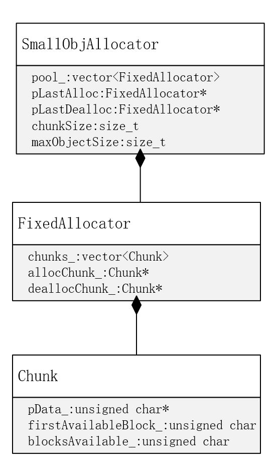
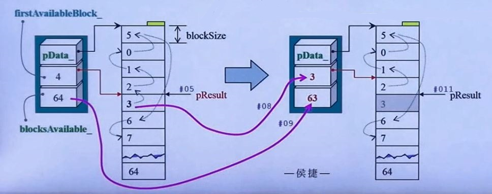
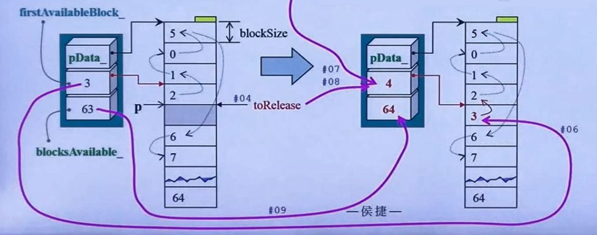
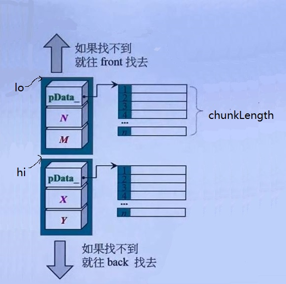

# C++内存管理

## 第四讲 loki::allocator

### loki allocator, 3 classes



#### Chunk

pData 指针，指向一整块空间

firstAvailableBlock：指向第一个可用区块，不是使用指针，而是一个索引，代表是第几号区块。

blocksAvailable_：目前还可以供应的区块

#### FixedAllocator

两个指针指向 chunks_ 中的某两个 Chunk

#### SmallObjAllocator

两个指针指向 pool_ 中的某两个 chunks_ 向量

### Chunk

```C++
void FixedAllocator::Chunk::Init(std::size_t blockSize, unsigned char blocks)
{
    pData_ = new unsigned char[blockSize * blocks];
    Reset(blockSize, blocks);
}
void FixedAllocator::Chunk::Reset(std::size_t blockSize, unsigned char blocks)
{
    first Available Block_ = 0;
    blocksAvailable_ = blocks;
    unsigned char i = 0;
    unsigned char* p = pData_;
    for(; i!=blocks; p += blockSize) // 流水号标示索引
        *p = ++i;
}

void FixedAllocator::Chunk::Release()
{
    delete[] pData_; // 释放自己
    // 此函数被上一层调用
}
```

```C++
void* FixedAllocator::Chunk::Allocate(std::size_t blockSize)
{
    if(!blocksAvailable_) return 0;
    
    unsigned char* pResult = 
        pData_ + (firstAvailableBlock_ * blockSize); // 指向第一个可用区块
    
    firstAvailableBlock_=*pResult; // 右侧索引便是下一个可用区块
    --blockAvailable_;
    
    return pResult;
}
```


图中第4块为优先权最高的区块，当需要分配空间时，将第四块分配出去。然后将其内容存到 firstAvailableBlock_ 中，即变为 3 ，可用区块数目减一，由 64 变为 63。

使用数组代替链表，索引代替指针。

```C++
void FixedAllocator::Chunk::Deallocate(void* n, std::size_t blockSize)

{
    unsigned char* toRelease = static_cast<unsigned char*> (p);

    *toRelease = firstAvailableBlock_;
    firstAvailableBlock_=static_cast<unsigned char>(
        (toRelease - pData_)/blockSize);
    ++blockAvailable_; // 可用区块数加1
}
```



将firstAvailableBlock\_的值赋给归还的空间，指针 p 减掉头，再除以每一块的大小得到 p 指向的是第几块。将其赋值给 firstAvailableBlock\_，

```C++
void* FixedAllocator::Allocate()
{
    if(allocChunk == 0 || allocChunk -> blocksAvailable_ == 0)
    {
        // 目前没有标定 chunk 或该 chunk 已无可用区块
        Chunks::iterator i = chunks_.begin(); // 打算从头朝气
        for(;;++i) // 找遍每个 chunk 直到找到拥有可用区块者
        {
            if (i==chunks_.end()) // 到达尾端都没找到
            {
                // Initialize
                // 创建 temp object 拷贝至容器然后结束生命
                chunks_.push_back(Chunk()); //产生 a new chunk 挂于末端
                Chunk & newChunk = chunks_.back(); // 指向末端
                newChunk.Init(blockSize_,numBlocks_); //设好索引
                allocChunk_ = &newChunk; // 标定，稍后将对此 chunk 取区块
                deallocChunk_=&chunks_.front(); // 另一标定
                berak;
            }
            if (i->blocksAbailable_>0)
            {
                // current chunk 有可用区块
                allocChunk_ = &*i; // 取其地址
                break; // 不找了，退出 for-loop
            }
        }
    }
    return allocChunk_->Allocate(blockSize_); // 向这个 chunk 取区块
    // 在此 chunk 找到可用区块，下次就优先由此找起。
}

void FixedAllocator::Deallocate(void* p)
{
    deallocChunk_ = VieinityFind(p); // 找区块位置
    DoDeallocate(p); // 回收
}
// FixedAllocator::VicinityFind(internal)
// Finds the chunk corresponding to a pointer, using an efficient search
FixedAllocator::Chunk* FixedAllocator::VieinityFind(void* p)
{
    const std::size_t chunkLength = numBlocks_* blockSize_;
    Chunk* lo = deallocChunk_;
    Chunk* hi = deallocChunk_ + 1;
    Chunk* loBound = &chunks_.front();
    Chunk* hiBound = &chunks_.back() + 1;
    
    for(;;) // 兵分两路
    { 
        if (lo) // 上路未到尽头
        {    
            if (p>=lo->pData_ && p < lo->pData_ + chunkLength)
                return lo; // p 落于 lo 区间内
        	if (lo == loBound) lo = 0; // 到顶了，让 loop 结束
        	else --lo; // 否则往 lo 的 front 继续找
        }
        if (hi) // 下路未到尽头
        {
            if (p->hi->pData_&&p<hi->pData_ + chunkLength)
                return hi; // p 落于 hi 区间内
            if (++hi == hiBound) hi == 0; // 往 hi 的 back 继续找
            // 若到最尾则让 loop 结束
        }
    }   
    return 0;
}
```



如果 p 并非当初由此系统取得，则肯定找不到对应的 chunk，于是跳不出 for-loop，陷入无穷循环。

```C++
void FixedAllocator::DoDeallocate(void* p)
{
    deallocChunk_->Deallocate(p,blockSize_);
    if(deallocChunk_->blocksAvailable_==numBlocks_)
    {
        // 确认安全回收，那么该 release 它吗？
        // 注意，以下三种情况都重新设定了 allocChunk_
        Chunk& lastChunk = chunks——.back(); // 标出最后一个
        // 如果最后一个就是当前 chunk
        if (&lastChunk == deallocChunk_)
        {
        	// 检查是否拥有两个 last chunks empty
            // 这只需往 front 方向看前一个 chunk 便知。
            if (chunks_.size() > 1 && deallocChunk_(-1).blocksAvailable _ == numBlocks_)
                 // 是的，有 2 free chunks，抛弃最后一个
            {
                lastChunk.Release();
                chunks_.pop_back();
                allocChunk_=deallocChunk_ = & chunks_.front();
            }
            return;
        }
        if (lastChunk.blocksAvailable_ == numBlocks_)
        {
            // 两个 free chunks, 抛弃最后一个
            lastChunk.Release();
            chunks_.pop_back();
            allocChunk_ = deallocChunk_;
        }
        else
        {
            // 将 free chunk 与最后一个 chunk 对调
            std::swap(*deallocChunk_.lastChunk);
            allocChunk_ = &chunks_.back();
        }
        
    }
}
```

### Loki allocator 优缺点

曾经有两个 bugs，新版已修正

精简强悍，手段暴力 （关于 for-loop）

使用以 array 取代 list，以 index 取代 pointer 的特殊实现手法

能够以很简单的方式判断 chunk 全回收，进而将 memory 归还给操作系统

有 Deferring（暂缓归还）能力

这是个 allocator，用老分配大量小块不带 cookie 的 memory blocks，他的最佳客户是容器，但本身却使用  vector。

