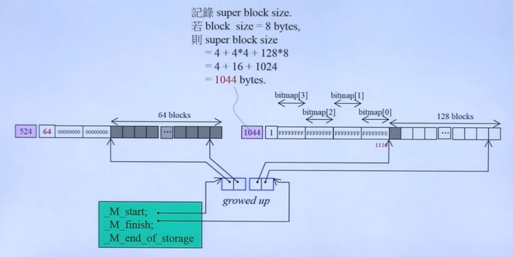
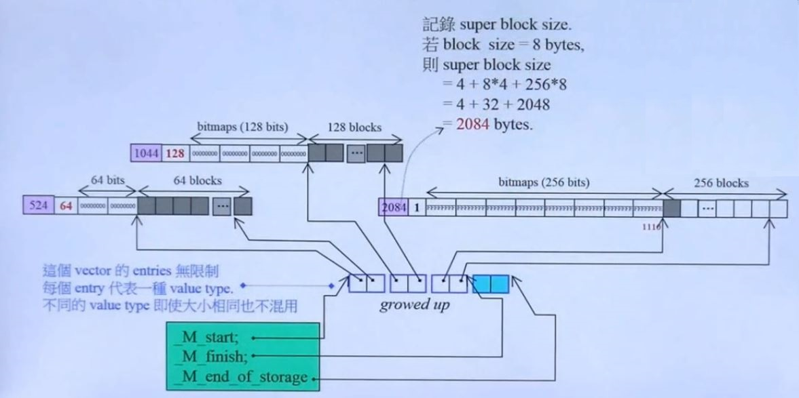
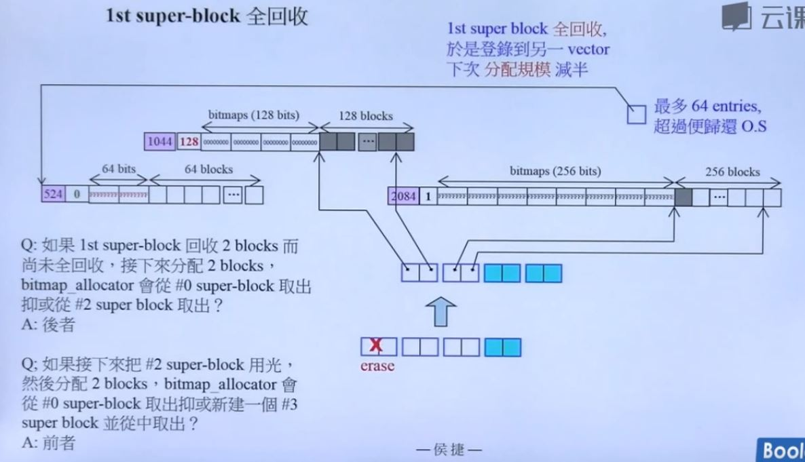
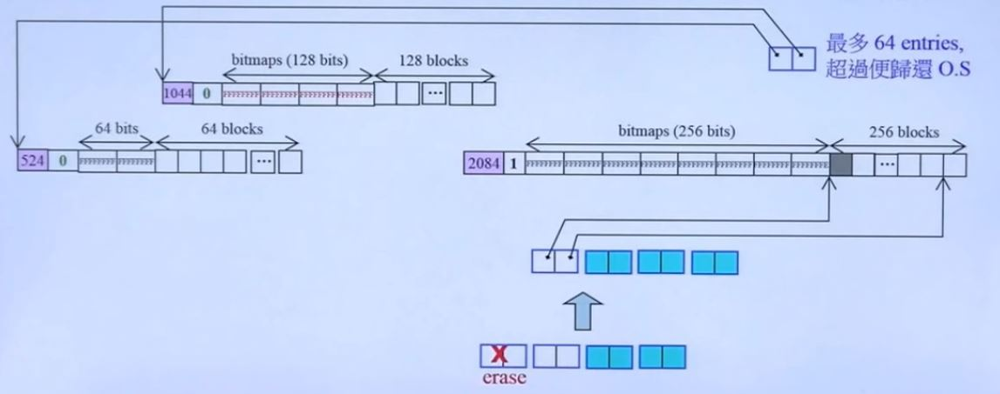

# C++内存管理

## 第五讲 other issues

### GNU C++ 对于 Allocator 的描述

当你将元素加入容器中，容器必须分配更多内存以保存这些元素，于是它们向其模板参数 Allocator 发出申请，该模板参数往往被另名为（aliased to）allocator_type。甚至你将 chars 添加到 string class 也是如此。因为 string 也算是一个正规的 STL 容器。

每个元素类型为 T 的容器（contianer-of-T）的 Allocator 模板实参默认为 allocator\<T\> ，其接口只有大约 20 个 public 声明，包括嵌套的（nested）typedefs 和成员函数，最重要的两个成员函数是：

```C++
T* allocate (size_type n, const void* hint = 0);
void deallocate (T* p, size_type n);
```

n 指的是客户申请的元素个数，不是指空间总量。

这些空间是通过调用 `::operator new` 获得，但何时调用以及多么频繁调用，并无具体指定。

```C++
template <class T, class Allocator = allocator<T>>
class vector;

template <class T, class Allocator = allocator<T>>
class list;

template <class T, class Allocator = allocator<T>>
class deque;
```

最容易满足需求的做法就是每当容器需要内存就调用 operator new，每当容器释放内存就调用 operator delete。这种做法比起分配大块内存并缓存（caching）然后徐徐小块使用当然较慢，优势则是可以在及大范围的硬件和操作系统上有效运作。

```C++
// __gnu_cxx::new_allocator
// 实现出简朴的 operator new 和 operator delete 语意
template<typename _Tp>
class new_allocator
{
    //......
    pointer allocate(size_type __n, const coid* = 0)
    {
        //......
        return static_cast<_Tp*>
            (::operator new(__n* sizeof(_Tp)));
    }
    void deallocate(pointer __p, size_type)
    {::operator delete(__p);}
};
// __gnu_cxx::malloc_allocator
// 其实现与上例唯一不同的是，它使用 c 函数 std::malloc 和 std::free
template <typename _Tp>
class malloc_allocator
{
    pointer allocate(size_type __n, const void*=0)
    {
        //......
        pinter __ret = ......(std::alloc(__n* sizeof(_Tp)));
    }
    void deallocate(pointer __p, size_type)
    {
        std::free(......(__p));
    }
};
```

另一种做法就是使用智能型 allocator，将分配所得的内存加以缓存（cache）。这种额外机制可以数种形式呈现：

- 可以是个 bitmap index，用以索引至一个以 2 的指数倍成长的篮子（exponentially increasing power-of-two-sized buckets)
- 也可以是个相较之下比较简易的 fixed-size pooling cache，这里所说的 cache 被程序内的所有容器共享，而 operator new 和 operator delete 不经常被调用，这颗带来速度上的优势。使用这类技巧的 allocators 包括
  - `__gnu_cxx::bitmap_allocator` 一个高效能 allocator，使用 bit-map 追踪被使用和未被使用（used and unused）的内存块
  - `__gnu_cxx::pool_allocator`
  - `__gnu_cxx::__mt_alloc`

Class allocator 只拥有 typedef, constructor 和 rebind 等成员，它继承自一个 high-speed extension allocators，也因此，所有分配和归还（allocation and deallocation）都取决于该 base class。而这个 base class 也许是终端用户无法碰触和操控的（use-configurable)。

很难挑选出某个分配策略说它能提供最大共同利益而不至于令某些行为过度劣势。事实上，就算要挑选何种典型动作以测量速度，都是一种困难。

GNU C++ 提供三项综合测试用已完成 C++ allocators 之间的速度评比：

- Insertion 经过多次 iterations 后各种 STL 容器将拥有某些极大量，分别测试循序式（sequence）和关联式（associative）容器。
- 多线程环境中的 insertion and erasure，这个测试展示 allocator 归还内存的能力，以及测量线程之间对内存的竞争。
- A threaded producer/consumer model，分别测试循序式和关联式容器。

另外两个智能型 allocator：

- \_\_gnu\_cxx::debug\_allocator
  - 这是一个外覆器（wrapper），可包覆于任何 allocator 之上，它把客户的申请量添加一些，然后由 allocator 回应，并以那一小块额外内存防止 size 信息，一旦 deallocate() 收到一个 pointer，就会检查 size 并以assert() 保证吻合
- \_\_gnu\_cxx::array\_allocator
  -  允许分配一已知且固定大小的内存块，内存来自 std::array objects。用上这个 llocator，大小固定的容器（包括 std::string）就无需再调用 ::operator new 和 ::operator delete。这就允许我们使用 STL abstractions 而无需再运行期添乱、增加开销。甚至再 program startup 情况下也可使用。

### VS 2013 标准分配器与 new_allocator

```C++
// 容器
template <class _Ty>
class _Alloc = allocator<_Ty>>
class list:public_List_buy<_Ty,_Alloc>
{
	// bidirectional linked list
	...
};

// TEMPLATE FUNCTION _Allocate
template<class _Ty> inline
    _Ty*_Allocate(size_t _Count, _Ty*)
{
    // allocate storage for _Count elements of type _Ty
    void *_Ptr = 0;
    if(_Count == 0);
    else if((()(-1)/sizeof(_Ty)<_Count)||(_Ptr = ::operator new(_Count*sizeof(_Ty))))
        _Xbad_alloc(); // report no memory
    return ((_Ty*)_Ptr);
}
// 《...\memory》
......
#include <xmemory>
// 《...\xmemroy》
......
#include <xmemroy0>

// 《...\xmemeory0》
template <class _Ty>
class allocator:public _Allocator_base<_Ty>
{	// generic allocator for objects of class _Ty
public:
	typedef value_type* pointer;
	typedef size_t size_type;
	
	void deallocate(pointer _Ptr, size _type)
    { // deallocate object at _Ptr, ignore size
    	::operator delete(_Ptr);
    }
    pointer allocate(size_type _Count)
    { // allocate array of _Count elements
    	return (_Allocate(_Count,(pointer)0)); // 实际上使用的是 operator new
    }
    pointer allocate(size_type _Count, const void*)
    { // allocate array of _Count elements, ignore hint
    	return (allocate(_Count));
    }
	...
};
```

### G4.9 标准分配器与 new_alloator

```C++
// <.../ext/new_allocator.h>
template <typename _Tp>
class new_allocator
{
    ...
    pointer allocate(size_type __n, const void*=0)
    {
        if (__n>this->max_size())
            std::__throw_bad_alloc();
        return static_cast<Tp*>(::operator new(__n* sizeof(_Tp)));
    }
    void deallocate(pointer __p, size_type)
    {
        ::operator delete(__p);
    }
    ......
};

//<bits/c++allocator.h>
#define __allocator_base __gnu_cxx::new_allocator
//<.../bits/allocator.h>
#include <ext\new_allocator.h>
template<typename _Tp>
class allocator:public __allocator_base<_Tp> {...};

// 《...\memory》
#include <bits\allocator.h>

//===============
template <typename _Tp, typename _Alloc = std::allocator<_Tp>>
class deque:protected_Deque_base<_Tp, _Alloc>{...};
```

### G4.9 malloc_allocator

```C++
// <.../ext/malloc_allocator.h>
template<typename _Tp>
class malloc_allocator
{
    //NB: __n is permitted to be 0, The C++ standart says nothing 
    // about what the return value is when __n == 0
    pointer allocate(size_type __n, const void* = 0)
    {
        if(__n > this->max_size())
            std::__throw_bad_alloc():
        pointer__ret = static_cast<_Tp*>(std::malloc(__n*sizeof(_Tp)));
        if(!__ret)
            std::__throw_bad_alloc();
        return __ret;
    }
    // __p is not permitted to be a null pointer.
    void deallocate(pointer __p, size_type)
    {
        std::free(static_cast<void*>(__p));
    }
    size_type max_size() const_GLIBCXX_USE_NOEXCEPT
    {
        return size_t(-1)/sizeof(_Tp);
    }
    ......
};
```

### G4.9 debug_allocator

```C++
// <.../ext/debug_allocator.h>
template<typename _Alloc>
class debug_allocator
{
    ......
private:
    size_type _M_extra; // 通常是个 size_t;
    _Alloc _M_allocator;
    
    size_type _S_extra()
    {
        const size_t __obj_size = sizeof(value_type);
        return (sizeof(size_type) + __obj_size - 1)/__obj_size;// 计算 extra（bytes）相当于几个元素
    }
public:
    debug_allocator(const _Alloc& __a):_M_allocator(__a), _M_extra(_S_extra()){}
    pointer allocate(size_type __n)
    {
        pointer __res = _M_allocator.allocat(__n + _M_extra);
        size_type* __ps = reinterpret_cast<size_type*> (__res);
        *__ps = __n;
        return __res + _M_extra;
    }
    void deallocate(pointer __p,size_type __n)
    {
        using std::__throw_runtime_error;
        if (__p)
        {
            pointer __real_p = __p - _M_extra;
            if(* reinterpret_cast<size_type*>(__real_p)!=__n)
                __throw_runtime_error ("debug_allocator::deallocate wrong size");
            _M_allocator.deallocate(__real_p,__n+_M_extra);
        }
        else
            __throw_runtime_error("debug_allocator::deallocate null pointer");
    }
}
```

### G4.9 bitmap_allocator

```C++
// <.../ext/bitmap_allocator.h>
template<typename _Tp>
class bitmap_allocator:provate free_list
{
public:
	pointer allocate(size_type __n)
    {
    	if(__n>this->max_size())
    		std::__throw_bad_alloc();
    	if(__builtin_except(__n==1,true))
    		return this->_M_allocate_single_object(); // 只为一个对象分配空间服务，
    	else // 需要对多个对象分配空间则使用 operator new
        {
        	const size_type __b = __n*sizeof(value_trype);
        	return reinterpret_cast<pointer>(::operator new(__b));
        }
    }
    void deallocate(pointer __p, size_type __n) throw()
    {
    	if(__builtin_expect(__p != 0, true))
        {
        	if(__builtin_expect(__n == 1, true))
        		this-> _M_deallocate_single_object(__p);
        	else
        		::operator delete(__p);
        }
    }
    ...
};
```

#### 关于 blocks，super-blocks，bitmap，mini-vector

第一个super-block 有 64 块 block

为了管理 64 块空间，需要两个整数（32位 * 2）bitmap[1] 和 bitmap[0]，每一 bit 位，0 表示空间被分配出去，1 表示未分配。

再前面有一个整数 use count，表示使用的块数

还有一个整数记录 super block size。若 block size = 8bytes，则 super block size = 4 + 2 * 4 + 64 * 8 = 524 bytes

每个单元两个指针，分别指向64块的头，尾的下一位置。

\_\_mini\_vector 中的\_M\_start 指向所有单元的头，\_M\_finish 指向所有单元的尾，\_M\_end\_of\_storage 指向末尾。

bitmap:FFFFFFFFFFFFFFFE (1110)，表示 64 块从左向右的第一块被分配出去。

bitmap 和 64 个区块的方向相反。

当前 63 个块都被分配出去时，bitmap 为 8（1000） 0 0 0 0 0 0 0 0 0 0 0 0 0 0 0

如果第一个 super-block 用光，则启动第二个 super-block





当第二块 super-block 用尽，则分配第三和第四块 super-block，只使用了 3，4 还未使用。 

若不曾全回收，则分配规模不断倍增，相当惊人，每次全回收便造成下一次分配规模减半。

#### 第一个 super-block 全回收






全回收时使用另一个名为 freelist 的 mini vector来回收。

这个 vector 的元素排列将以 super block size 为依据，因此当触及 threshold(64)，新进者若大于最末者便直接 delete 新进者，否则 delete 最末者，然后再 insert 新进者。若未触及 64 则无条件 insert 至适当位置。

