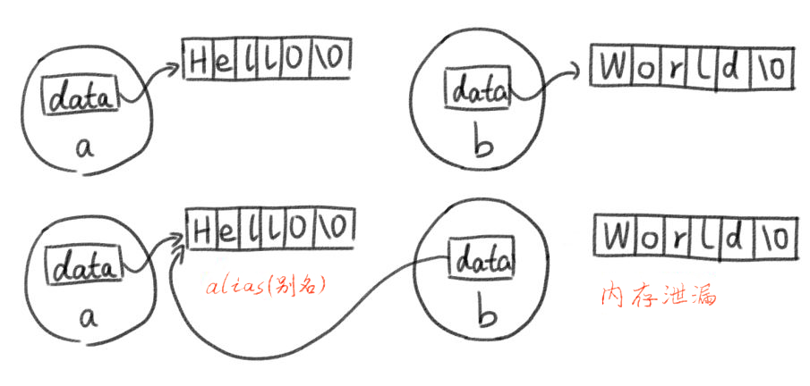
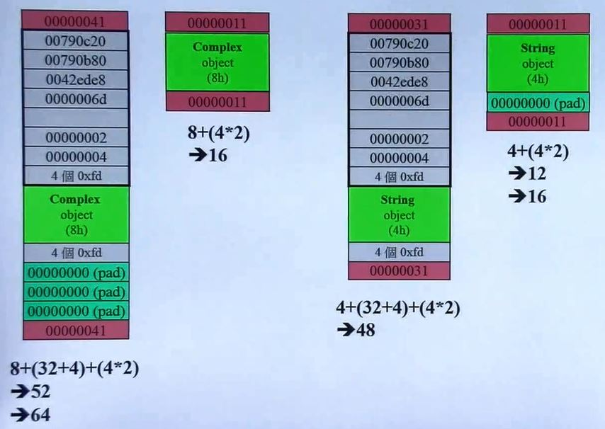
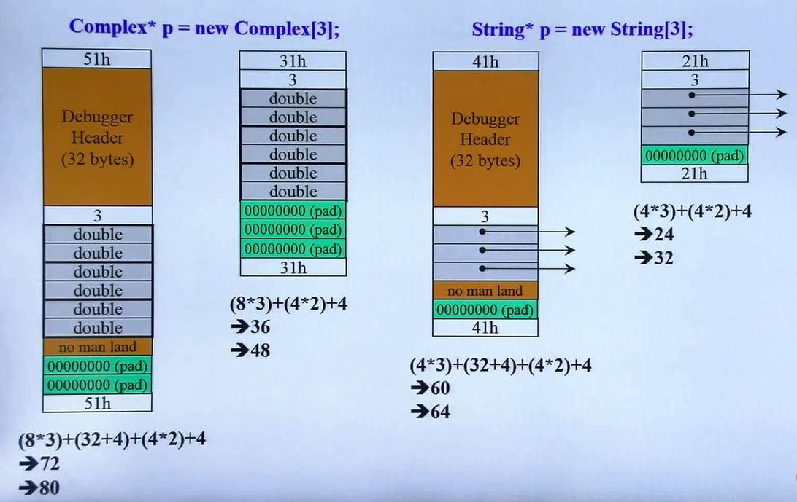
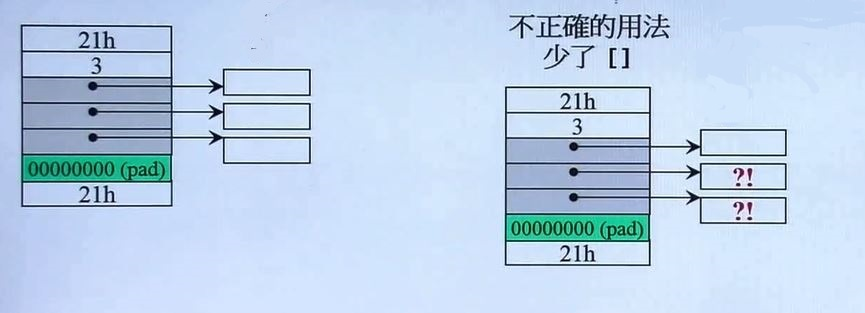

# C++ 面向对象高级开发

> 侯捷 C++面向对象高级开发

## 三大函数：拷贝构造、拷贝赋值、析构

```C++
#ifndef __MYSTRING__
#define __MYSTRING__

class String
{
    ...
}
String::function(...)...
Global-function(...)...

#endif
//==============
int int main()
{
    String s1();
    String S2("hello");
    String s3(s1); // 拷贝构造
    cout << s3 << endl;
    s3 = s2; // 拷贝赋值
    cout << s3 << endl;
}
// 编译器自动提供拷贝构造和拷贝赋值函数
// 对于带指针的类，不能使用编译器提供的拷贝构造和拷贝赋值函数
```

```C++
class String
{
public:
    String(const char* cstr = 0);
    String(const String& str);
    String& operator=(const String& str);
    ~String();
    char* get_c_str() const {return m_data;}
private:
    char* m_data; // 创建一个指针指向字符串，使用动态的方式
}
```

### ctor 和 dtor

```C++
inline String::STring(const char* cstr = 0)
{
    if (cstr)
    {
        m_data = new char[strlen(cstr)+1];
        strcpy(m_data, cstr);
    }
    else // 未指定初值
    {
        m_data = new char[1];
        *m_data = '\0';
    }
}
inline String::~String()
{
    delete[] m_data;
}

//==================
{
    String s1();
    String s2("hello");
    
    String* p = new String("hello");
    delete p;
    // p要手动销毁，s1 和 s2 在离开作用域的时候会自动调用析构函数
}
```

**class with pointer members 必须有 copy ctor 和 copy op=**

copy assignment operator 拷贝赋值

```C++
String a("Hello");
String b("World");
```

使用 default copy ctor 或 default op= 就会导致内存泄漏

浅拷贝



#### copy ctor(拷贝构造函数)

```C++
// 深拷贝
inline String::String(const String& str)
{
    m_data = new char[ strlen(str.m_data) + 1 ];
    strcpy(m_data, str.m_data);
    // 直接取另一个 object 的 private data（兄弟之间互为 friend）
}
//===========
{
    String s1("hello ");
    String s2(s1);
 // String s2 = s1;
}
```

#### copy assignment operator(拷贝赋值函数)

```C++
inline String& String::operator=(const String& str)
{
    if (this == &str)
        return *this;// 检测自我赋值（self assignment)
    delete[] m_data;
    m_data = new char[strlen(str.m_data) + 1];
    strcpy(m_data, str.m_data);
    return *this;
}
// 赋值 左边=右边；
// 先把左边杀掉，开辟一块和右边一样大的空间，将右边的值拷贝到左边
// 如果不检测自我赋值，先把左边杀掉，右边指向和左边相同的位置也被杀掉了。
//==============
{
    String s1("hello ");
    String s2;
    s2 = s1;
}
```

### output函数

```C++
class String
{
public:
	...
    char* get_c_str() const {return m_data;}
private:
    ...
}
//-----------
#include <iostream.h>
ostream& operator << (ostream& os, const String& str)
{
    os << str.get_c_str();
    return os;
}

//======================
{
    String s1("hello");
    cout << s1;
}
```


## 堆、栈与内存管理

### 所谓 stack（栈），所谓 heap（堆）

#### stack

存在于某作用域（scope）的一块内存空间（memory space）。例如当你调用函数，函数本身即会形成一个 stack 来防止它所接收的参数，以及返回地址，以及 local object。

在函数本体（function body）内声明的任何变量，其所使用的内存块都取自上述 stack。

#### heap

或谓 system heap，是指由操作系统提供的一块 global 内存空间，程序可动态分配（dynamic allocated）从某中获得若干区块（blocks）。

动态取得， 通过 new 获取，使用完毕后有义务将其释放

```C++
class Complex {...}
...
{
    Complex c1(1,2); // 占用空间来自 stack
    Complex* p = new Complex(3);
    // complex(3)是个临时对象
    // 其所占用的空间乃是以 new 自 heap 动态分配而得，并由 p 指向。 
}
```

### stack objects 的生命期

stack objects 离开作用域它的生命就会结束。这种作用域内的 object 又称为 auto object，因为它会被**自动**清理

### static local objects 的生命期

静态对象：其生命在作用域结束之后仍然存在，直到整个程序结束。

```C++
{
    Complex c1(1,2); // 离开作用域生命结束
	static Complex c2(1,2); // 静态对象 生命直到程序结束
}
```

### global objects 的生命期

全局对象：其生命在整个程序结束之后才结束，也可以把它视为一种 static object，其作用域是**整个程序**

```C++
Complex c3(1,2); // 全局对象
int main()
{...}
```

### heap objects 的生命期

p 所指的便是 heap object，其生命在它被 deleted 之际结束。

如果在不作用域内 delete，当作用域结束，所指的 heap object 仍然存在，但指针 p 的生命却结束了，作用域外看不到 p，也无法 delete p，就会造成**内存泄漏**

```C++
{
    Complex *p = new Complex;
    ...
    delete p;
}
{
    Complex* p = new Complex;
    // 没有 delete
}
```

### new：先分配 memory，再调用 ctor

```C++
Complex* pc = new Complex(1,2);
// 编译器转化为
Complex *pc;
void* mem = operator new (sizeof(Complex)); // 分配内存 其内部调用 malloc(n)
pc = static_cast<Complex*>(mem); // 转型
pc->Complex::Complex(1,2); // 构造函数
// Complex::Complex(pc, 1, 2);  // pc  ==> this
```

### delete：先调用 dtor，再释放 memory

```C++
String* ps = new String("Hello");
...
delete ps;
// 编译器转化为
String::~String(ps); // 析构函数
operator delete(ps); //释放内存，其内部调用 free(ps)
```

### 动态分配所得的内存块（in VC)



分配一个 double，在调试模式下会获得52个字节，而在 VC 底下，每一块内存都是 16 的倍数，因此会获得 64 字节。非调试模式下，会获得 16 字节

红色：cookie 记录整块的大小，便于回收

64 的 16 进制为 40，cookie 记录为 41，用最后一位表示是分配出去还是收回。1 表示该块已经分配出去。16 的倍数的 16 进制最后一位都是 0

### 动态分配所得的 array

VC 用一个整数记录数组的大小  （图中白色内容为 3 的块）



**array new 要搭配 array delete，不然会出错**

```C++
String* p = new String[3];
...
delete [] p; // 唤起 3 次 dtor
//====================
String* p = new String[3];
...
delete p; // 唤起 1 次 dtor
```

由于 cookie 的存在，无论是不是 array delete 都会删除分配的整块内存，但是 array delete 会调用 3 次 dtor，分别杀掉各自分配的内存，而没有 [ ] 只会唤起一次 dtor，



如果没有指针，不适用 array delete 也不会造成内存泄露。

