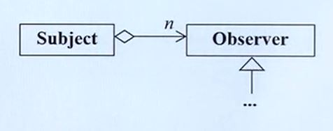

# C++ 面向对象高级开发

> 侯捷 C++面向对象高级开发

## 模板类、函数模板及其他

### static

可以加在变量名前或函数名前，构成静态变量或静态函数。

```C++
class complex
{
public: 
    double real() const // （）里不能写this
	{
        return this->re; // this->可写可不写。
    }
private:
    double re, im;
}
// non static
complex c1, c2, c3; // 对象可以有很多个
cout << c1.real();
cout << c2.real();
//===>
cout << complex::real(&c1);
cout << complex::real(&c2); // 传递的实际上是对象的地址

// 加 static 之后数据和对象脱离
// 静态的数据只有一份
// 静态函数没有 this 指针

// 举例：银行的系统，为每一个客户创建一个对象，但是只创建一个利率，设计为静态
class Account
{
public:
    static double m_rate; // 声明
    static void set_rate(const double&) {m_rate = x;}
};
double Account::m_rate = 8.0; // 如果是静态数据，一定要在class外部定义，是否设初值可选。

int main()
{
    Account::set_rate(5.0); // 通过 object 调用静态函数
    
    Account a;
    a.set_rate(7.0); // 通过 class name 调用静态函数
}
```

### 把 ctors 放在 private 区

```C++
// Singleton
class A
{
public：
    static A& getInstance(return a; );
    setup() {...}
private:
    A();
    A(const A& rhs);
    static A a;
    ...
};
A::getInstance().setup();
// 通过对象a调用 setup() 函数
//=================
// 更好的写法
// Meyers Singleton
class A
{
public：
    static A& getInstance();
    setup() {...}
private:
    A();
    A(const A& rhs);
    ...
};
A& A::getInstance()
{
    static A a;
    return a;
}

A::getInstance.setup();
//调用 getInstance 时，才创建对象 a，没有人使用时单例则不存在。
```

### 进一步补充：cout

```C++
class _IO_ostream_withassign:publc ostream{...};

extern _IO_ostream_withassign cout;

class ostream : virtual public ios
{
public:
	ostream& operator<<(char c);
	ostream& operator<<(unsigned char c){return (*this)<<(char)c;}
	ostream& operator<<(signed char c){return(*this)<<(char)c;}
	ostream& operator<<(const char *s);
	ostream& operator<<(const unsigned char*s)
	{return (*this)<<(const char*)s;}
	ostream& operator<<(const signed char*s)
	{return (*this)<<(const char*)s;}
	ostream& operator<<(const void*p);
	ostream& operator<<(int n);
	ostream& operator<<(unsigned int n);
	ostream& operator<<(long n);
	ostream& operator<<(unsigned long n);
	...
}
```

### 进一步补充： class template，类模板

```C++
template <typename T>
class complex
{
public:
    complex(T r = 0, T i = 0)
        :re (r), im(r)
        { }
    complex& operator += (const complex&);
    T real() const {return re;}
    T imag() const {return im;}
private:
    T re, im;
    firend complex& __doapl (complex*, const complex&);
};
//=========
{
    complex<double> c1(2.5,1.5); // 把 T 全部替换为double
    complex<int> c2(2,6); // 把 T 全部替换为 int
    ...
}
```

### 进一步补充：function template，函数模板

```C++
template <class T> 
inline const T& min(const T& a, const T& b)
    // 编译器会对 function template 进行引数推导 argument deduction
{
    return b<a?b:a; // T 为 stone，则调用 stone::operator<
}
class stone
{
public:
    stone(int w, int h, int we)
        : _w(w), _h(h), _weight(we){ }
    bool operator< (const stone& rhs) const
    {
        return _weight < rhs._weight;
    }
private:
    int _w, _h, _weight;
}
//=======
stone r1(2,3), r2(3,3), r3;
r3 = min(r1, r2);
```

### 进一步补充：namespace

```C++
namespace std // namespace 名
{
    ...
}// 所有东西被包装在这个命名空间中
//======
// using directive
using namespace std;
// using declaration
using std::cout;
std::cin >> ...;
cout << ...;
//
std::cin >> ...;
std::cout << ...;
```

## 组合与继承

inheritance 继承

composition 复合

delegation 委托

### composition（复合）表示 has-a

```C++
template <class T, class Sequence = deque<T> >
class queue
{
    ...
protected:
   Sequence c; // 底层容器，c的类型为 deque<T>
public:
    // 以下完全利用 c 的操作函数完成
    bool empty() const {return c.empty();}
    size_type size() const {return c.size();}
    reference front() {return c.front();}
    reference back() {return c.back();}
    // deque 是两端可进出，queue是末端进前端出。（先进先出）
    void push(const value_type& x) {c.push_back(x);}
    void pop() {c.pop_front();}
};
```


黑色菱形表示有东西，queue 中有一个 deque。

所有功能在 c 中已经完成，queue 借用 c 中的函数。

设计模式：Adapter

deque 的功能比 queue 强大，queue 只开放了 deque 其中的几个函数。

```C++
// Sizeof: 40
template <class T>
class queue
{
protected:
    deque<T> c;
    ...
}

// Sizeof:16*2 + 4 + 4
template <class T>
class deque
{
protected:
    Itr<T> start;
    Itr<T> finish;
    T** map;
    unsigned int map_size;
};

// Sizeof:4*4
template <class T>
struct Itr
{
    T* cur;
    T* first;
    T* last;
    T** node;
    ...
};
```

#### composition（复合）关系下的构造和析构

构造由内而外

Container 的构造函数首先调用 Component 的 default 构造函数，然后才执行自己。

`Container::Container(...):Component(){...};`

析构由外而内

Contianer 的析构函数首先执行自己，然后才调用 Component 的析构函数。

`Container::~Container(...){... ~Component()}//最后析构component`


### Delegation（委托） Compositon by reference\

Handle / Body (pImpl)

```C++
// file String.hpp
class StringRep;
class String
{
public:
    String();
    String(const char* s);
    String(const String& s);
    String &operator=(const String& s);
    ~String();
    ...
private:
    StringRep* rep; // pimpl // 需要时指针才被创建
};

// file String.cpp
#include "String.hpp"
namespace
{
class StringRep
{
friend class String;
    StringRep(const char* s);
    ~StringRep();
    int count;
    char* rep;
};
}

String::String(){...}
...
```

String 类只提供接口，实现都通过 StringRep 来完成。String 需要实现时都调用 StringRep 的函数来服务

pointer to implementation (pipml) 又叫编译防火墙，左边的变动不会影响用户。


共享，前提是内容一样。需要改变内容时，将内容复制，再修改 （copy on wirte）

### Inheritance（继承）表示is-a

```C++
struct _List_node_base
{
    _List_node_base* _M_next;
    _List_Node_base* _M_perv;
};

template <typename _Tp>
struct _List_node : public _List_node_base
{
	_Tp _M_data;
};
```


`_List_node` 子类 `_List_node_base`  父类

public 继承表示 is-a 的关系

父类的数据被完整地继承下来

#### Inheritance（继承）关系下的构造和析构

构造由内而外

Derived 地构造函数首先调用 Base 的 default 构造函数，然后才执行自己

`Derived::Derived(...): Base() {...};`

析构由外而内

Derived 的析构函数首先执行自己，然后才调用 Base 的析构函数

`Derived::~Derived(...){... ~Base()};`


base class 的 dtor 必须是 virtual，否则会出现 undefined behavior

继承由三种：public private protect

## 虚函数与多态

Inheritance with virtual functions

non-virtual 函数：你不希望 derived class 重新定义（overwrite，覆写）它

virtual 函数：你希望derived class 重新定义它，且你对它已有默认定义。

pure virtual 函数：你希望 derived class 一定要重新定义它，你对它没有默认定义。

```C++
class Shape{
public:
    virtual void draw() const = 0; // pure virtual
    virtual void error(const std::string&msg); // impure virtual
    int objectID() const; // non-virtual
    ...
};

class Rectangle: public Shape{...};
class Ellipse:public Shape{...};
```

### Inheritance with virtual

例如：打开不同的文件的操作

打开文件的操作为父类，针对每个文件打开时的操作为子类。

```C++
// Template Method设计模式
// application framework
CDocument::OnFileOpen()
{
    ...
    Serialize() // this->Serialize(); ===> (*(this->vptr)[n])(this);
    // virtual Serialize(),声明时表示是虚函数
    ...
}

// application
class CMyDoc : public CDocument
{
	virtual Serialize() {...}
};

main()
{
    CMyDoc myDoc;
    ...
    myDoc.OnFileOpen(); // CDocument::OnFileOpen(&myDoc);
    // 通过子类对象调用父类函数
}
//==============
#include <iostream>
using namespace std;
class CDocument
{
public:
    void OnFileOpen()
    {
        // 这是个算法，每个 cout 输出代表一个实际动作
        cout << "dialog..." << endl;
        cout << "check file status..." << endl;
        cout << "open file..." << endl;
        Serialize();
        cout << "close file..." << endl;
        cout << "update all views..." << endl;
    }
    virtual void Serialize() {}; // 虚函数
};

class MyDoc : public CDocument
{
public:
	virtual void Serialize()
    {
    // 只有应用程序本身才知道如何读取自己的文件（格式）
    	cout << "CMyDoc::Serialize()" << endl;
    }
}

int main()
{
    CMyDoc myDoc; // 假设对应[file/open]
    myDoc.OnFileOpn();
}
```

### Inheritance + Composition 关系下的构造和析构


base 和 component 谁先谁后？

上图：先 base，后 component，最后 derived

下图：先 compenent 后 base，最后 derived。析构顺序相反

### Delegation（委托）+ Inheritance（继承）

#### Observer 设计模式

例如：word 中绘画多种图形、多个子窗口

```C++
class Subject
{
    int m_value;
    vector<Observer*> my_views;
public:
    void attach(Observer* obs)
    {
        m_views.push_back(obs);
    }
    void set_val(int value)
    {
        m_value = value;
        notify();
    }
    void notify()
    {
        for (int i = 0; i < m_views.size(); ++i)
            m_views[i]->update(this,m_value);
    }
}

class Observer
{
public:
    virtual void update(Subject* sub, int value) = 0
}
```




#### Composite 设计模式

例：写一个 file system / window system


file==>primitive

```C++
class Component
{
    int value;
public:
    Component(int val) { value = val;}
    virtual void add(Component*) {}
};

class Compositive: public Component
{
	vector<Component*> c;
public:
	Composite(int val): Component(val) {}
	
	void add(Component* elem) 
    {
    	c.push_back(elem);
    }
    ...
};
class Primitive: public Component
{
public:
	Primitive(int val):Component(val){}
}
```

#### Prototype 设计模式

prototype 原型


需要创建未来的 class 对象 ==> 每一个子类创建一个对象（原型），需要被框架看到，因此，在框架中有一块空间，用来存放子类的原型。

图中下划线表示静态：LAST、SPOT...

函数名前的 '-' 表示 privite ；'+' 表示component，可以省略；'#'表示 protected

写法 变量名称 : 变量类型

LandSatImage

通过调用 private 构造函数 LandSatImage()，通过addPrototype(this) 将自己添加到框架中。

addPrototype 父类函数

子类通过clone()函数从框架端对原型进行复制

```C++
// from Design Patterns Explained Simply
#include <iostream>
enum imageType
{
    LAST, SPOT
};
class Image
{
public:
    virtual void draw() = 0;
    static Image * findAndClone(imageType);
protected:
    virtual imageType return Type() = 0;
    virtual Image* clone() = 0;
    // As each subclass of Images is declared, it registers its prototype
    static void addPrototype(Image* image)
    {
        _prototypes[_nextSlot++]=image;
    }
    private:
    // addPrototype() saves each registered prototype here
    static Image* _prototypes[10];
    static int _extSlot;
};
Image *Image::_prototypes[];
int Image::_nextSlot;
// class 内静态的 data 一定要在外部给初值或初始化

// Client call this public static member function when it needs 
// an instance of an Image subclass
Image* Image:: findAndClone(imageType type)
{
    for(int i = 0; i < _nextSlot; i++)
        if(_prototypes[i]->returnType()==type)
            return _prototypes[i]->clone();
}

// 子类
class LandSatImage:public Image
{
public:
	imageType returnType()
    {
    	return LAST;
    }
    void draw()
    {
    	cout << "LandSatImage::draw" << _id<<endl;
    }
    // When clone() is called, call the one-argument ctor with a dummy arg
    Image *clone()
    {
    	return new LandSatImage(1);
    }
protected:
	// this is only called from clone
	LandSatImage(int dummy) // dummy只是为了区分两个构造函数，防止copy时原型被覆盖。
    {
    	_id = _count++;
    }
private:
	// Mechanism for initializing an Image subclass - this cause the
	// default ctor to be called, which registers the subclass's prototype
static LandSatImage _landSatImage;
	// this is only called when the pribate statcic data member is
	// inited
	LandSatImage()
    {
    	addPrototype(this);
    }
    // Nominal "state" per instance mechanism
    int _id;
    static int_count;
};

// Register the subclass's prototype
LandSatImage LandSatImage::_landSatImage;
// Initialize the "state" per instance mechanism
int LandSatImage::_count = 1;

class SpotImage:public Image
{
public:
	imageType returnType()
    {
    return SPOT;
    }
    ...
    // 和上面的子类相同
}
```

