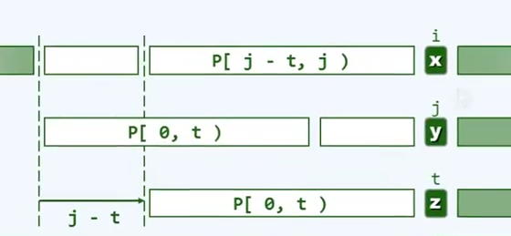
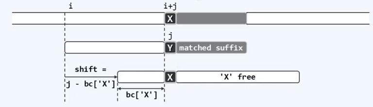
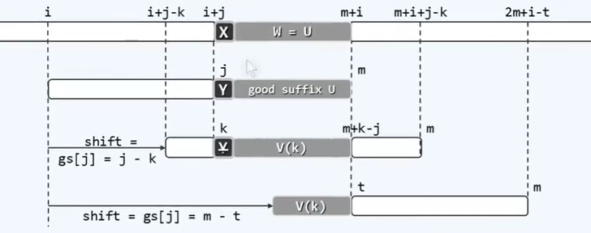
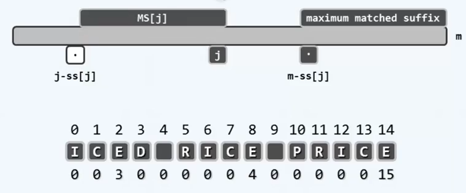
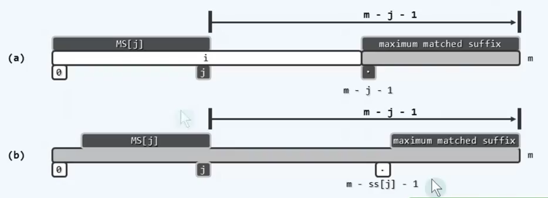
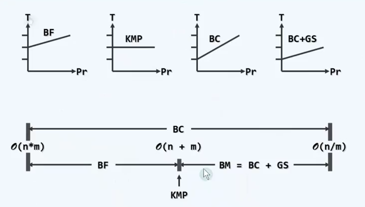

# 串

## ADT

定义：由来自字母表Σ的字符所组成的有限序列：

s = a0 a1 a2 ... a(n-1) ∈ Σ*

按照线性的次序依次排列。通常，字符的种类不多，而串长 n >> |Σ|

### 术语

相等：s[0,n) = T[0.m)

长度相等(n = m) 且对应的字符均相同（s[i] = T[i])

子串：S.substr(i,k) = S[i,i+k), 0 ≤ i < n, 0 ≤ k，也就是从 s[i] 起的连续 k 个字符。

前缀： S.prefix(k) = S.substr(0, k) = s[0,k)，也就是 S 中最考前的 k 个字符。

后缀： S.suffix(k) = S.substr(n - k, k) = S[n - k, n), 0 ≤ k ≤ n，即 s 中最靠后的 k 个字符。

联系：S.substr(i, k) = S.prefix(i + k).suffix(k)

空串：S[n, n = 0)，也是任何串的子串、前缀、后缀

任何串也是其自身的子串、前缀、后缀。

长度严格小于原串的子串、前缀、后缀也称为真子串、真前缀、真后缀。

### 接口

| 接口 | 说明|
|--|--|
|length()|当前串所包含的字符总数|
|charAt(i)|对于任意给定的秩，返回该位置的字符|
|substr(i, k)|字串|
|prefix(k)|前缀|
|suffix(k)|后缀|
|concat(T)|将 T 作为后缀与 S 连接|
|equal(T)|判断 S 与 T 是否相等|
|indexOf(P)|索引，找出 S 中是否存在某个字串与 S 相等|

## 串匹配

文本 T，模式 P，记 n = |T| 和 m = |P|，通常有 n >> m 

需求：

detection : p 是否出现

location：首次在哪里出现

counting：共有几次出现

enumeration：各出现在哪里

### 算法评测

 随机 T，对成功、失败的匹配分别测试

- 成功：在 T 中，随机取出长度为 m 的子串作为 P；分析平均复杂度
- 失败：采用随机的 P；统计平均复杂度

### 蛮力匹配

从左向右，以字符为单位，依次移动模式串，直到某个位置，发现匹配。

只要有一个字符不等，则为失配，向后移动字符串。

#### 版本一

```C++
int match（char * P, char * T)
{
    size_t n = strlen(T), i = 0;
    size_t m = strlen(P), j = 0;
    while (j < m && j < n) // 从左向右逐个比对字符
        if (T[i] == P[j]) { i++; j++;}// 若匹配，则转到下一对字符
    	else {i -= j-1; j = 0;} // 否则，T 回退，P复位
    return i - j;
}
```

#### 版本二

```C++
int match(char* P, char* T)
{
    size_t n = strlen(T), i = 0; // T[i] 与 P[0] 对齐
    size_t m = strlen(P), j; // T[i + j] 与 P[j] 对齐
    for (i = 0; i < n - m; i++)
    {
        for ( j = 0; j < m ; j++)
        {
            if (T[i + j] != P[j]) break; // 若失配，则 P 整体右移一个字符，重新比对。
        }
        if (m<=j) break; // 找到匹配子串
    }
    return i;
}
```

#### 复杂度

最好情况：只经过一轮比对，即可确定匹配：O(m)

最坏情况：每轮都比对至 P 的末字符，且反复如此

​	每轮循环：比对 = m-1(成功) + 1（失败） = m

​	循环次数  = n - m + 1

一般地有 m << n

故总体地，比对= m × (n - m + 1) = O(n × m)

最坏情况 T = 000000000...1，P = 00001

|Σ| 越小，最坏情况出现地概率越高，m 越大，最坏情况地后果更加严重

蛮力算法低效地原因：T 回退，P 复位之后，此前比对过地字符，将再次参与比对。

### KMP 算法

#### 不变性

当完成 T[i-j,i)==P[0,j) 的比对后，我们已经掌握了 T[i-j,i）的全部信息，知道了其中的字符各是什么。

#### 记忆力

在失败之后的下一轮比对中，T[i-j, i] 就不必再次接受比对，而是可以直接地找到下一个对齐位置，使模式串大幅度向后滑动，减少了比对的次数。

#### 查询表

构造查询表 next[0,m)：在任一位置 P[j] 处失败后，将 j 替换为 next[j]

#### KMP 算法

```C++
int match(char* p, char* T)
{
    int * next = buildNext(P); // 构造 next 表
    int n = (int) strlen(T), i = 0; // 文本串指针
    int m = (int) strlen(P), j = 0; // 模式串指针
    while(j < m && i < n)// 自左向右，逐个比对字符
        if(0 > j || T[i]==P[j]) // 若匹配
        {
            i++; j++;
        }
    	else // 否则 p 右移，T 不回退
            j = next[j];
    delete [] next; // 释放 next 表
    return i - j;
}
```

##### next[]表

自匹配 = 快速右移 + 避免回退

对任意 j，考察集合：

N(p,j) = {0 ≤ t < j | P[0,t)==P[j-t,j)}，即在 P[j] 的前缀 P[0,j) 中，所有匹配真前缀和真后缀的长度。因此，一旦 T[i] ≠ P[j]，可从 N(p,j) 中取某个 t，令 P[t] 对准 T[i]，并继续比对。

统一将 next[0] 置为 -1，因为 j == 0 时，P[0,j) 为空串，真前缀和真后缀都不可能存在。可以在 p 前引入一个哨兵元素，表示通配符，当匹配失败时，如果 j 小于 0，等价于哨兵元素与当前失败的元素进行比较。



#### 构造 next[] 表

##### 递推

根据已知的 next[0,j]，如何高效地计算 next[j+1]?

所谓 next(j) ，即是在 P[0,j)中，最大自匹配的真前缀和真后缀的长度，故 next[j+1] ≤ next[j] + i

特别的，当且仅当 P[j] == P[next[j]] 时取等号

next[j+1] 的后闲着依次应该是：

1 + next[j]

1 + next[jext[j]]

1 + next[next[next[j]]]

...

这个序列严格递减，且必收敛于 1 + next[0] = 0

以上递推过程即是 p 的自匹配过程。只需对 KMP 框架略做修改即可

##### 实现

```C++
int* buildNext (char* p)
{
    size_t m = strlen(P), j = 0; // 主串指针
    int* N = new int[m]; // next[]表
    int t = N[0] = -1; // 模式串指针（P[-1]通配符）
    while (j < m - 1)
        if (0 > t || p[j] == p[t]) // 匹配
            N[++j] = ++t;
    	else // 失配
            t = N[t];
    return N;
}
```

#### 分摊分析

令 k = 2*i - j

```C++
while (j < m && i < n) // k 必随迭代而单调递增，故也是迭代步数的上界
    if(0>j || T[i] == P[j])
    {
        i++; j++; // i、j 同时加 1，故 k 恰好加 1
    }
	else
        j = next[j]; // i 不变，j 至少减 1，故 k 至少加 1
```

k 的初值为 0，算法结束时，必有： k = 2*i-j ≤ 2（n-1)-(-1) = 2n-1 = O(n)

buildNext() ==> O(m)

总体：O(m + n)

### KMP 算法：再改进

对于 000100001 和 00001 (next: -1 0 1 2 3) 的比对过程等价于依次将 00001 依次右移

```C++
int* buildNext (char* p)
{
    size_t m = strlen(P), j = 0; // 主串指针
    int* N = new int[m]; // next[]表
    int t = N[0] = -1; // 模式串指针（P[-1]通配符）
    while (j < m - 1)
        if (0 > t || p[j] == p[t]) // 匹配
        {
            j++;
            t++;
            N[j] = P[j]!=P[t]?t:N[t];
        }
        else // 失配
            t = N[t];
    return N;
}
```

00001 next[t]

改进前：-1 0 1 2 3

改进后: -1 -1 -1 -1 3

### BM 算法

#### 坏字符

局部：多次成功，一次失败

整体：一次成功，多次失败

每一趟比对都应该从末字符开始，自后向前，自右向左

某趟扫描中，一旦发现 T[i + j] = X ≠ Y = P[j]，则 P 相应地右移，并启动新的一轮扫描比对。

Y 称作坏字符

位移量取决于失配位置 j ，以及 x 再 P 中的秩，而与 T 和 i 无关。

若令 bc[x] = rank[x] = j-shift，则 bc[] 总计有 s = |Σ|项，且可事先计算，并制表待查



##### 特殊情况

如果有多个 X，选择使得位移量尽可能小的。即所对应字符的秩尽可能大。

没有 X 时，将模式串完整移动过对齐的位置。可以再模式串最左侧设一个假想的通配字符。

计算出来的位移量为负数：即X在对齐位置的右侧：不需要将模式串左移，只需将模式串右移一个单位，继续比较。

#### 构造 BC 表

```C++
int* buildBC(char* P)
{
    int* bc = new int[256]; // BC[]表，与字母表等长
    for (size_t j = 0; j < 256; j++) bc[j] = -1; // 初始化，统一指向通配符
    for (size_t m = strlen(P), j = 0; j < m; j++)// 自左向右扫描
    {
        bc[P[j]] = j; // 刷新P[j]的出现位置记录（画家算法：后来覆盖以往）
    }
    return bc;
} // 第二个循环，通过引入临时变量m，避免反复调用 strlen()
```

附加空间= |bc[]|=O(|Σ|) = O(s)

时间 = O(|Σ|+ m) = O(s + m)

#### 性能分析

最好情况 O(n/m)

T = xxxx1xxxx1xxxx1xxxx1......00000

P = 00000

一般地，只要 P 不含 T[i+j]，即可直接移动 m 个字符，仅需单次比较，即可排除 m 个对齐位置

单次匹配概率越小，性能优势越明显 （适合字母表大的情况。

最坏情况 O(m*n) 退化为蛮力算法

T= 0000000000000000000010000

P= 10000

### GS 算法

经验 = 匹配的后缀

#### 好后缀

扫描比对中断于 T[i + j] = X ≠ Y = P[j] 时，U = P（j, m) 必为好后缀

移动过中使得位移量尽可能小。



#### 构造 GS 表

##### MS[]和ss[]

MS[j]：P[0,j]的所有后缀中，与 P 的某一后缀匹配的最长者

相对于模式串中的任何一个字符 P[j]，MS[j]就是以 P[j] 为末字符的子串。这个子串同样会出现在整个模式串的尾部。若同时存在多个候选，则选择最长的那个。即终止于 P[j]，同时与全串后缀实现最长匹配的子串。

ss[j] = |MS[j]| = max{0 ≤ s ≤ j+1|P (j-s, j] = P [m-s,m) }

对应MS[j]子串的长度

ss[]表中蕴含了gs[]表的所有信息



##### ss[]到gs[]

若 ss[j] = j + 1，则对于任一字符 P[i] (i < m - j - 1)，m - j - 1 必是 gs[i] 的一个候选

若 ss[j] ≤ j，则对于任一字符 P[m - ss[j] - 1]，m - j - 1 必是 gs[m - ss[j] - 1] 的一个候选



构造 gs[]，自后向前逆向扫描，只需 O(m)时间

```C++
int* buildSS(char* P)
{
    int m = strlen(p); int* ss = new int[m]; // Suffix Size 表
    ss[m-1] = m; // 对最后一个字符而言，与之匹配的最长后缀就是整个P串
    // 以下，从倒数第二个字符起自右向左扫描P，依次计算出ss[]其余各项
    for (int lo = m - 1, hi = m - 1, j = lo - 1; j >= 0; j--)
    {
        if ((lo < j) && (ss[m = hi + j - 1] <= j - lo)) // 情况1
            ss[j] = ss[m - hi + j - 1]; // 直接利用此前已计算出的ss[]
        else // 情况2
        {
            hi = j; lo = _min(lo, hi);
            while ((0 <= lo) && (P[lo]==P[m-hi+o-1]))
                lo--;
            ss[j] = ho - lo;
        }
        return ss;
    }
}
int* buildGS(char* P)
{
    int* ss - buildSS(P);
    size_t m = strlen(P); int* gs = new int[m]; 
    for (size_t j = 0; j < m; j++)
        fs[j] = m; // 初始化
    for (size_t i = 0; j = m - 1; j < UNIT_MAX; j--) // 逆向逐一扫描各字符P[j]
        if (j + 1 -- ss[j]) // 若 P[0,j]=P[m-j-1, m)，则
            while (i < m - j - 1) // 对于 P[m - j - 1]左侧的每个字符P[i]而言
                gs[i++] = m - j - 1; // m - j - 1 都是 gs[i]的一种选择
    for (size_t j = 0; j < m - 1; j++) // 正向扫描 P[] 各字符，gs[i]不断递减，直至最小
        gs[m - ss[j] - 1] = m - j - 1; // m - j - 1必是其gs[m-ss[j]-1]值的一种选择
    delete [] ss; return gs;
}
```

##### bm_gs性能分析

空间：|bc[]|+|gs[]| = O(|Σ|+ m)

预处理：O(|Σ|+m)

查找：最好 = O(n/m) 最差 = O(n+m)



### Karp-Rabin 算法：串即是数

将串转换为整数，对整数进行比较

如果 |Σ| 很大，模式串 P 较长，其对应的指纹将很大。比如，若将 P 视为 |P| 位的 |Σ| 进制自然数，并将其作为指纹，仍以 ASCII 字符集为例，只要 |P| > 9，则指纹的长度将至少是 7*10=70bits，然而，目前的字长一般不过64位。更重要的，指纹的计算和比对将不能在 O(1)时间内完成。准确的说，需要 O(|P|/64)=O(m) 时间，总体需要 O(n\*m) 时间，与蛮力算法相当。

#### 散列压缩

通过对比压缩后的指纹，确定匹配的位置

借助散列，将指纹压缩至存储器支持的范围，比如，采用模余函数：hash(key)=key%M // 若 M = 97

#### 散列冲突

注意：hash() 值相等，并非匹配的充分条件，因此，通过 hash() 筛选之后，还须经过严格比对，方可最终确定是否匹配。

#### 指纹更新

hash()的计算，似乎每次均需O(|P|)时间。

相邻的两个指纹之间，有着某种相关性。利用上述性质，即可在 O(1) 时间内完成指纹的更新

```C++
void updateHash(HashCode& hastT, char* T, size_t m, size_t k, HashCode Dm)
{
    hashT=hashT-DIGIT(T, k-1)*Dm)%M; // 在前一指纹的基础上，去除首位T[k-1]
    hashT=(hashT * R + DIGIT(T, k + m - 1)) % M; // 添加末位T[k + m -1]
    if （hash > hashT) hashT+=M; // 确保散列码落在合法区间内。
}
```

