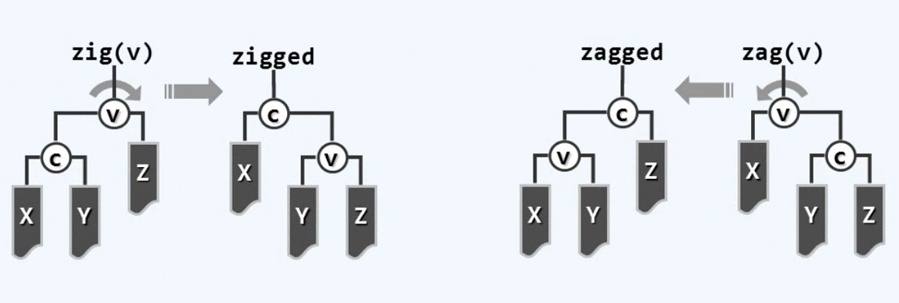
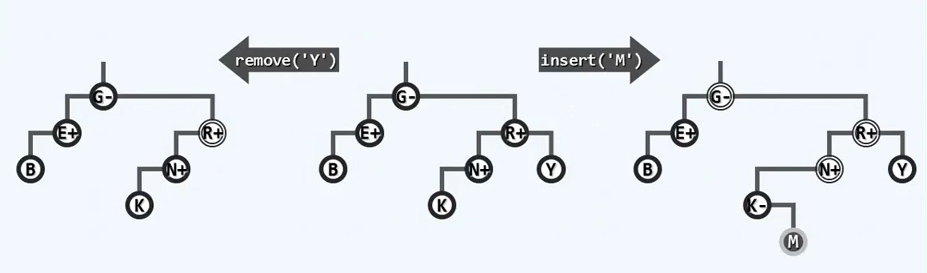
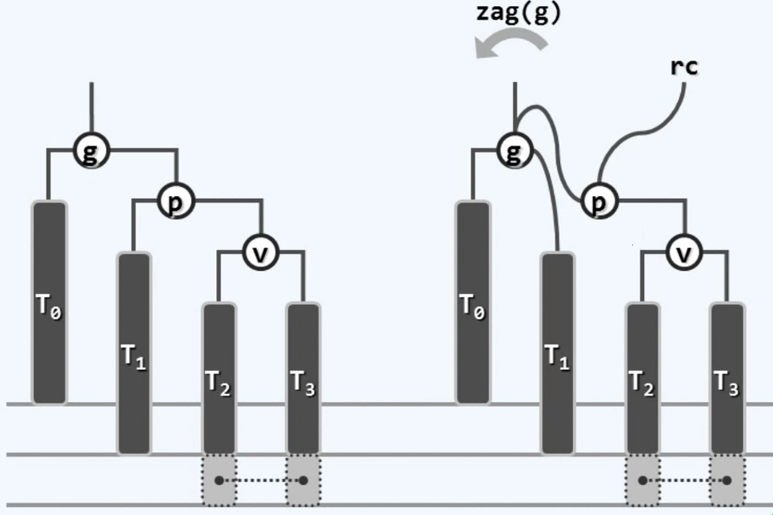
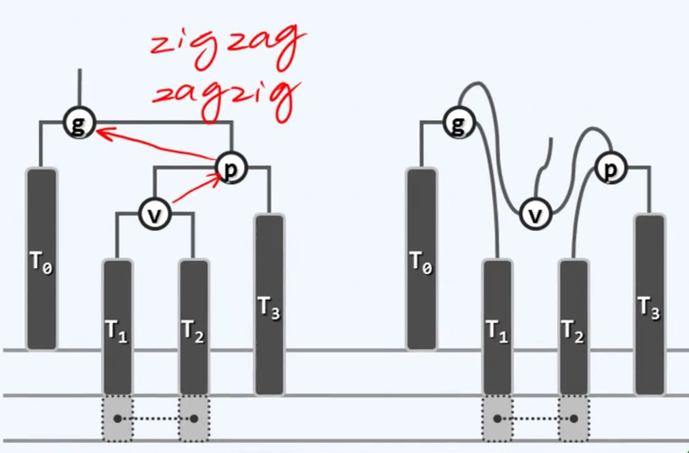
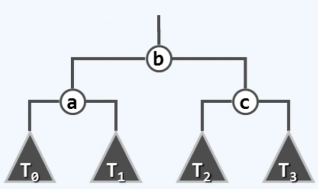
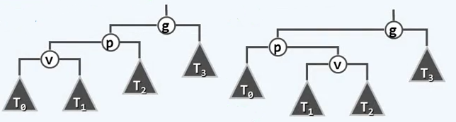

# 二叉搜索树

[清华大学 邓俊辉 数据结构](http://www.xuetangx.com/courses/course-v1:TsinghuaX+30240184_2X+sp/about)

##　概述

### 循关键码访问

- 数据项之间，依照各自的关键码彼此区分
  - call by key
- 条件：关键码之间支持
  - 大小比较与相等比对
- 数据集合中的数据项
  - 统一地表示和实现为词条 entry 形式

#### 词条

```C++
template <typename K, typename V> struct Entry // 词条模板类
{
    K key; V value; //关键码、数值
    Entry(K k = K(), V v = V()):key(k), value(e.value){}; //默认构造函数
    Entry(Entry<K, V> const & e): key(e.key), value(e.value){};//克隆
    // 比较器、判断器（从此，不必严格区分词条及其对应的关键码）
    bool operator < (entry<K,V> const & e){return key < e.key;} //小于
    bool operator > (entry<K,V> const & e){return key > e.key;} //大于
    bool operator ==(entry<K,V> const & e){return key == e.key;}//等于
    bool operator !=(entry<K,V> const & e){return key != e.key;}//不等
}
```

### 二叉搜索树

Binary Seatch Tree(BST)

节点~词条~关键码

#### 顺序性

任一节点均不小于/不大于其左/右**后代**

为简化起见，禁止重复词条==>这种简化：应用中不自然，算法上无必要

#### 单调性

BST 的中序遍历序列，必然单调非降

这一性质也是 BST 的充要条件

### BST 模板类

```C++
template <typename T> class BST : public BinTree<T> // 由 BinTree 派生
{
public: // 以 virtual 修饰，以便派生类重写
    virtual BinNodePosi(T) & search(const T &); // 查找
    virtual BinNodePost(T) insert(const T &); // 插入
    virtual bool remove(const T &); // 删除
protected：
    BinNodePosi(T) _hot; // 命中节点的父亲
    BinNodePosi(T) connect34( // 3 + 4 重构
    	BinNodePosi(T), BinNodePosi(T), BinNodePosi(T),
        BinNodePosi(T), BinNodePosi(T), BinNodePosi(T), BinNodePosi(T));
    BinNodePosi(T) rotateAt( BinNodePosi(T)); //旋转调整 
};
```

## 算法与实现

### 查找算法

将查找的关键码与节点比较，若目标关键码小于节点，则存在于节点的左子树，否则存在于右子树

将二叉搜索树中序遍历存储在向量中，则在有序向量中，可视为二分查找

#### 实现

```C++
template <typename T> BinNodePosi(T) & BST <T>::search(const T & e)
{
    return searchIn(_root, e, _hot = NULL); // 从根节点启动查找
}
static BinNodePosi(T) & searchIn( // 典型的尾递归，可改为迭代版
	BinNodePosi(T) & v, // 当前（子）树根
	const T & e, // 目标关键码
	BinNodePosi(T) & hot) // 记忆热点
{
    if (!v||(e==v->data)) return v; //足以确定失败、成功，或者
    hot = v; //先记下当前（非空）节点，然后再...
    return searchIn(((e<v->data)? v->lChild:v->rChild), e, hot);
} // 运行时间正比于返回节点 v 的深度，不超过树高 O(h)
```

#### 接口语义

返回的引用值：

- 成功时，指向一个关键码为 e 且真实存在的节点
- 失败时，指向最后一次试图转向的空节点 NULL

失败时，不妨假象地将此空节点转换为一个数值为 e 的哨兵节点，如此，依然满足 BST 的充要条件；而且更重要地，无论成功与否，返回值总是等效地指向命中节点，而 `_hot` 总是指向命中节点的父亲。

相当于找到插入元素 e 的位置

### 插入算法

先借助 `search(e)` 确定插入的位置及方向，再将新节点作为叶子插入

若 e 尚不存在，则：`_hot` 为新节点的父亲，`v.search(e)` 为 `_hot` 对新孩子的引用

```C++
template <typename T> BinNodePosi(T) BST<T>::insert (const T & e)
{
    BinNodePosi(T) & x = search (e); // 查找目标（留意 _hot 的设置）
    if (!x) // 即禁止雷同元素，故仅在查找失败时才实施插入操作
    {    
        x = new BinNode<T>(e, _hot); // 再 x 处创建新节点，以 _hot 为父亲
    _size++; updateHeightAbove(x); // 更新全树规模，更新 x 及其历代祖先的高度
	}
    return x; // 无论 e 是否存在于原树中，至此总有 x->data == e
} // 验证：对于首个节点插入之类的边界情况，均可正确处置。
// 复杂度 O(h)
```

### 删除算法

```C++
template <typename T> bool BST <T>::remove(const T & e)
{
    BinNodePosi(T) & x = search(e); // 定位目标节点
    if (!x) return false; // 确认目标存在(此时 _hot 为 x 的父亲)
    removeAt(x, _hot); // 分两大类情况实施删除，更新全树规模；
    _size--; // 更新全树规模
    update HeightAbove(_hot); // 更新 _hot 及其历代祖先的高度。
    return true;
} // 删除成功与否，由返回值指示

template <typename T> static BinNodePosi(T)
removeAt(BinNodePosi(T) & x, BinNodePosi(T) & hot)
{
    BinNodePosi(T) w = x; // 实际被摘除的节点，初值同x
    BinNodePosi(T) succ = NULL; // 实际被删除节点的接替者
    if (!HasLChild(*x)) succ = x = x->rChild; // 左子树为空
    else if (!HasRChild(*x)) succ = x = x->lChild; // 右子树为空// 此类情况仅需O(1)时间
    else // 左右子树并存的情况，略微复杂 // O(h)
    {
    	w = w->succ(); swap (x->data, w->data); // 令 *x 与其后继 *w 互换数据
        BinNodePosi(T) u = w->parent; //原问题即转化为摘除非二度的节点 w
        (u == x ? u->rChild : u->lChild) = succ = w->rChild; // 分支只可能是右孩子
    }
    hot = w->parent; // 记录实际被删除节点的父亲
    if (succ) succ->parent = hot; // 将被删除节点的接替者与 hot 相联
    release(w->data); release(w); // 释放被摘除节点
    return succ; // 返回接替者
}  // 最坏O(h)
```

#### 删除：情况1

若*x的某一子树为空（至多只有一个孩子），则可将其替换为另一子树，即用其子树替换该节点

#### 删除：情况2

找到要删除节点在中序遍历中的直接后继，互相对换，转化为情况1，再删除节点

要删除节点再中序遍历中的直接后继一定是一个左侧分支的末端，不可能有左孩子。

## 平衡与等价

### 平均高度

#### 随机生成

对 n 个关键码随机排列，按排列顺序插入二叉搜索树，全排列总共有 n! 种，平均高度为 O（log n）

#### 随即组成

将 n 个关键码视作 n 个互异的积木，再满足 BST 要求的前提下，考察它们能够组成多少棵结构互异的 BST

易证，所有 BST 的总数为 catalan(n) ,平均树高为O(sqrt(n))

后者更为可信，因为前者可能重复，不同的关键码排列可能生成相同的 BST

接近中位数的关键码更早地插入，所得的 BST 高度更小，更容易重复，因此前者的估计结果偏小

### 理想平衡

节点数目固定时，兄弟子树高度越接近（平衡），全树将倾向于更低

结论：由 n 个节点组成的二叉树，高度不低于 log_2 n，恰为 log_2 n 时，称作**理想平衡**

理想平衡再实际应用中出现的可能很低，且维护成本过高，需要适当放松标准

高度渐进地不超过O(log n)，即可称作**适度平衡**

适度平衡的 BST 称作**平衡二叉搜索树 (BBST)**

### 等价 BST

不同结构的二叉树的中序遍历序列可能完全相同：中序遍历序列的歧义性

拓扑结构不同但中序遍历序列相同的两个 BST 称为**等价BST**

- 上下可变：联接关系不尽相同，承袭关系可能颠倒
- 左右不乱：中序遍历序列完全一致，全局单调非降

### 等价变换+旋转调整



再此局部以节点 v 为中心进行旋转

操作的时间可以严格的控制在O(1) 

操作的次数不能超过O(log n)

AVL树可以达到O(1)，红黑树可以把两者都控制在O(1)

## AVL 树

### 重平衡

#### 平衡因子

balFac(v) = height(lc(v)) - height(rc(v))

对于二叉树中任意一个节点 v ,都可以定义它的平衡因子 balFac 为左子树与右子树高度之差

G. Adelson-Velsky & E.Landis 规定，AVL 树的中任意一个节点的平衡因子的绝对值小于等于 -1

#### 适度平衡

可以证明 AVL 树时适度平衡的

height(AVL) = O(logn) 一棵规模为 n 的 AVL 树，其高度再渐进意义下不超过O(logn)

n = Ω(2^height(AVL)) 可以证明再高度固定的情况下，一棵 AVL 树的节点不会太少

高度为 h 的 AVL 树，至少包含S(h) = fib(h+3)-1 个节点，规模下限为S(h)

S(h) = 1 + S(h-1) + S(h-2) 

S(h) + 1=  [S(h-1) + 1] + [S(h-2) + 1]

上式写为 T(h) = T(h-1)  + T(h-2) = fib(h+?)

| h | n | T(h)|
|--|--|--|
|0|1|2=fib(3)|
|1|2|3=fib(4)|

T(h) 为斐波那契数列向后移3位。

斐波那契数列呈 Ф^h 形式增长，由此可得 n 的下界 n = Ω(Ф^h)，h的上界 h = O(logn)，满足适度平衡的要求。

#### 接口

```C++
#define Balance(x) \ // 理想平衡
	(stature((x).lChild) == stature((x).rchild)) // 左右子树高度完全相等
#define BalFac(x)\ // 平衡因子
	(stature(x).lChild)-stature((x).rChild)) // 左右子树高度之差
#define AvlBalanced(x) \ // AVL平衡条件
    (( -2 < BalFac(x)) && (BalFac(x) < 2)) // -1<=平衡因子<=1

template <typename T> class AVL : public BST<T> // 由BST派生
{
public: // BST::search()等接口可直接沿用
    BinNodePosi(T) inster(const T&); // 插入重写
    bool remove(const T &); // 删除重写
}

```

#### 失衡、复衡



插入 M，导致 N、R、G失衡。AVL 树中插入节点可能导致若干个祖先失衡。其他节点不会受影响

删除操作至多只有一个节点失衡。祖先的高度由相对更长的分支决定，删除节点不一定会改变节点的高度，至多只会影响一个祖先。

### 插入

#### 单旋

同时有多个失衡节点，最低者 g 不低于 x 的祖父

g 经单旋调整后复衡，子树高度复原；更高祖先也必平衡，全树复衡

时间消耗 O(1)

g、p、v三个节点在朝向上一致向右，操作为 zagzag，对称操作为 zigzag




从失衡的局部出发，对节点 g 进行一次逆时针旋转，使得节点 g 复衡

引入临时指针指向节点 p，令 p 的左子树成为 g 的右子树，令 g 成为 p 的左孩子，令这一部分子树的根为 p，完成旋转

#### 双旋

节点朝向不一致，zigzag 或 zagzig

同时可能有多个失衡节点，最低者 g 不低于 x 的祖父

g 经过双旋后复衡，子树高度复原；更高祖先也必先平衡，全树复衡



#### 实现

```C++
template <typename T> BinNodePosi() AVL<T>::insert(const T & e)
{
    BinNodePosi(T) & x = search(e);
    if (x) return x; // 若目标尚不存在
    x = new BinNode<T>(e, _hot);
    _size++;
    BinNodePosi(T) xx = x; // 则创建 x
    // 以下，从 x 的父亲出发逐层向上，依次检查各代祖先 g
    for (BinNodePosi(T) g = x->parent; g; g = g->arent)
    {
        if (!AvlBalanced(*g)) // 一旦发现 g 失衡，则通过调整回复平衡
        {
            FromParentTo(*g) = rotateAt(tallerChild(tallerChild(g)));
            break; // g 复衡后，局部子树高度必然复原，其祖先亦必如此，故调整结束
        }
        else // 否则（在依然平衡的祖先处），只需简单地更新其高度
            updateHeight(g);// 平衡性虽然不变，高度却可能改变
    } 
    return xx; // 返回新节点：至多只需一次调整
}
```

### 删除

#### 单旋

同时至多一个失衡节点 g，首个可能就是 x 的父亲 _hot

当节点朝向一致时，围绕失衡节点做一次旋转操作

g 经过单旋调整后复衡，子树高度未必复原；调整之后的分支高度可能会缩短，更高祖先仍可能失衡。因有失衡传播现象，可能需做 O(logn) 次调整

#### 双旋

同时至多一个失衡节点 g，首个可能就是 x 的父亲 _hot

调整完成后，高度收缩一层，存在失衡传播现象。

#### 实现

```C++
template <typename T> bool AVL<T>::remove(const T& e)
{
    BinNodePosi(T) &x = search(e); // 若目标的确存在，则按 BST 规则删除之后
    if (!x) return false;          // _hot 及祖先均有可能失衡
    removeAt(x, _hot);
    _size--;
    // 以下，从 _hot 出发逐层向上，一次检查各代祖先 g
    for (BinNodePosi(T) g = _hot; g; g = g->parent) // 起点为被删除节点的父亲
    {
        if (!AvlBalanced(*g)) // 一旦发现 g 失衡，则通过调整回复平衡
            g = FromParentTo(*g) = rotateAt(tallerChild(tallerChild(g)));
        updateHeight(g); // 更新高度
    } // 可能需做过 Ω(logn) 次调整； 无论是否做过调整，全树高度军可能下降
    return true;
}
```

## 3+4 重构

### 算法

设 g(x) 为最低的失衡节点，考察祖孙三代：g~p~v，按中序遍历次序，将其重命名为：a < b < c，它们总共拥有互不相交的四颗（可能为空的）子树，按中序遍历次序，将其重命名为：T0<T1<T2<T3

可以构造为



称为 3+4 重构，无论插入、删除、单旋或者双旋，最终的结果都是这样。

### 实现

```C++
template <typename T> BinNodePosi(T) BST<T>:;connect34(
	BinNodePosi(T) a, BinNodePosi(T) b, BinNodePosi(T) c,
    BinNodePosi(T) T0, BinNodePosi(T) T1, BinNodePosi(T) T2, BinNodePosi(T) T3)
{
    a->lChild = T0; if (T0) T0->parent = a;
    a->rChild = T1; if (T1) T1->parent = a; updateHeight(a);
    c->lChild = T2; if (T2) T2->parent = c;
    c->rChild = T3; if (T3) T3->parent = c; updateHeight(c);
    b->lchild = a; a->parent = b;
    b->rChild = c; c->parent = b; updateHeight(b);
    return b; // 该子树新的根节点
}

// 统一调整
template <typename T> BinNodePosi(T) BST<T>::rotateAt(BinNodePosi(T) v)
{
    BinNodePosi(T) p = v->parent, g = p->parent; // 父亲，祖父
    // 分别判断 p 和 v 分别是左孩子还是右孩子，来区分 zig-zag zig-zig zag-zig zag-zag
    if (IsLChild(*p)) // zig
        if (IsLChild(*v)) //zig-zag
        {
            p->parent = g->parent; //向上联接
            return connect34(v, p, g, v->lChild, v->rChild, p->rChild, g->rChild);
        }
    	else // zig-zag
        {
            v->parent = g-parent; //向上连接
            return connect34(p, v, g, p->lChild, v->lChild, v->rChild, g->rChild);
        }
    else
    {/* .. zag-zig & zag-zag ..*/}
    
}
```



### 综合评价

#### 优点

无论查找、插入或删除，最坏情况下的复杂度均为O(logn)，O(n)的存储空间

#### 缺点

借助高度或平衡因子，为此需改造元素结构，或额外封装

实测复杂度与理论值尚有差距

- 插入/删除后的旋转，成本不菲
- 删除操作后，最多需旋转 Ω(logn) 次（Knuth：平均仅0.21次）
- 若需频繁进行插入/删除操作，未免得不偿失

单词动态调整后，全树拓扑结构的变化量可能达到 Ω(logn)

insert O(1) remove O(logn)