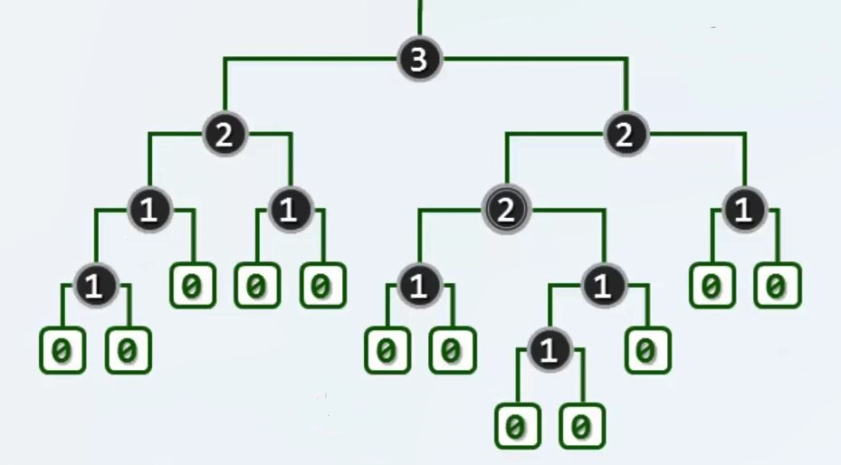
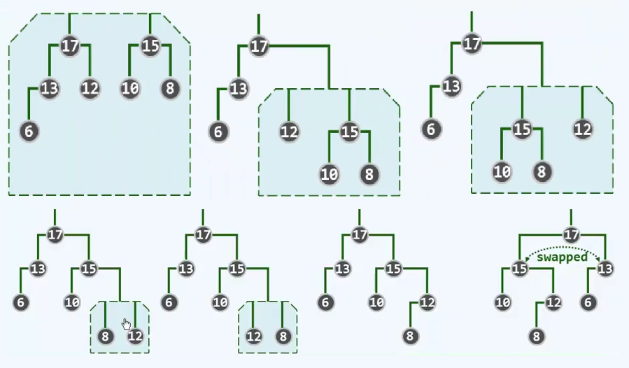

# 优先级队列

[清华大学 邓俊辉 数据结构](http://www.xuetangx.com/courses/course-v1:TsinghuaX+30240184_2X+sp/about)

## 需求与动机

循优先级访问

### 功能接口

```C++
template <typename T> struct PQ // priority queue
{
    // 接口设为纯虚函数，要求后续给出实现
    virtual void insert(T) = 0; // 按照优先级次序插入词条
    virtual T getMax() = 0; // 取出优先级最高的词条
    virtual T delMax() = 0; // 删除优先级最高的词条
}； // 与其说 PQ 是数据结构，不如说是 ADT；其不同的实现方式，效率及适用场合也各不相同。
```

Stack 和 Queue 都是 PQ 的特例——优先级完全取决于元素的插入次序

## 完全二叉堆

### 完全二叉树

Complete  Binary Tree 平衡因子处处非负的 AVL

只在最底层右侧缺失若干节点

逻辑上，等同于完全二叉树，物理上，直接借助向量实现，完全二叉树的节点与向量中的元素一一对应(逻辑节点与物理元素依层次遍历次序彼此对应)

```C++
#define Parent(i) ((i-1) >> 1) // 向量中秩为 i 的元素，其父节点必等于 (i-1)/2
#define LChild(i) (1 + ((i)<< 1)) // 奇数 左孩子对应 2*i+1
#define RChild(i) ((1 +(i)) << 1) // 偶数 右孩子对应 (i+1)*2
```

### 完全二叉堆

PQ——ComplHeap = PQ + Vector

```C++
template <typename T> class PQ_ComplHeap:public PQ<T>, public Vector<T>
{
protected:
	Rank percolateDown(Rank n, Rank i); // 下滤
	Rank percolateUp (Rank i); // 上滤
	void heapify (Rank n); // Floyd建堆算法
public:
	PQ_ComplHeap(T* A, Rank n) // 批量构造
    {
    	copyFrom(A, 0, n);
    	heapify(n);
    }
    void insert(T); // 按照比较器确定的优先级次序，插入词条
    T getMax()
    {
    	return _elem[0]; // 读取优先级高的词条
    }
    T delMax(); // 删除优先级高的词条
};
```

### 堆序性

数值上，只要 0 < i，比满足 H[i] <= H[Parent(i)]，即任何一个节点，在数值上不会超过它的父亲。因此，最大元一定在根节点。

### 插入与上滤

为插入词条 e，只需将 e 作为末元素接入向量。结构性自然保持。若堆序性亦未破坏，则完成；否则只可能是 e 与其父节点违反堆序性。 e 与其父节点换位，若堆序性因此恢复，则完成。

不断重复，直到满足堆序性或到达堆顶。

```C++
template <typename T> vode PQ_ComplHeap<T>::insert(T e) // 插入
{
    Vector<T>::insert(e);
    percolateUp(_size - 1);
}
template <typename T> // 对第 i 个词条实施上滤，i < _size
Rank PQ_ComplHeap<T>::percolateUp(Rank i)
{
    while (ParentValid(i))
    {
        //只要 i 有父亲（尚未抵达堆顶)，则
        Rank j = Parent(i); //将 i 之父记作 j
        if (lt(_elem[i], _elem[j])) break; // 一旦父子不再逆序，上滤旋即完成
        swap (_elem[i], _elem[j]); i = j; //否则，交换父子位置，并上升一层
    }// while
    return i; // 返回上滤最终抵达的位置。
}
```

#### 效率

比较操作 O(logn)

由于使用 swap，赋值操作需要 3 * logn

可以先复制插入元素，如果需要上滤，将父节点下移，不需要上滤时将插入元素放进去，则赋值需要log n+2

通常情况下，每个节点上升的高度为 O(1)

### 删除与下滤

最大元素始终在堆顶，故删除之，只需：

- 摘除向量首元素，代之以末元素 e // 结构性仍然保持
- e 与孩子中大者换位
- 直到满足堆序性或到达堆底

```C++
template <typename T> T PQ_ComplHeap<T>::delMax() // 删除
{
    T maxElem = _elem[0]; _elem[0] = _elem[--_size]; //摘除堆顶，代之以末词条
    percolateDown(_size, 0); // 对新堆顶实施下滤
    return maxElem; // 返回此前备份的最大词条
}
template <Typename T> // 对前 n 个词条中的第 i 个实施下滤， i < n
Rank PQ_ComplHeap<T>::percolateDown(Rank n, Rank i)
{
    Rank j; // i 及其（至多两个）孩子中，堪为父者
    while (i != (j = ProperParent (_elem, n, i))) // 只要 i 非 j，则
    {
        swap(_elem[i], _elem[j]);
        i = j; // 换位，并继续考察 i
    }
    return i; // 返回下滤抵达的位置 (亦 i 亦 j)
}
```

#### 效率

比较操作 O(logn)

赋值操作 3*logn 同样可以优化

下滤操作需要对左右两个孩子都做比较，而上滤操作只需与父节点比较一次。

### 批量建堆

#### 自下而上的上滤

```C++
PQ_ComplHeaP(T * A, Rank n) {copyFrom(A, 0, n); heapify(n);}
template <typename T> void PQ_ComplHeap<T>:;heapify (Rank n) // 蛮力
{
    for (int i = 1; i < n; ++i) // 按照层次遍历次序逐一(自上而下，自左而右)
        percolateUP(i); //经上滤插入各节点
}
```

最坏情况下，每个节点都需上滤至根，所需成本线性正比于其深度。

即便只考虑底层，n/2 个叶节点，深度均为 O(logn)，累计耗时 O(nlogn)，不可接受

因为这样长的时间足以全排序。

#### 自下而上的下滤

任意给定堆 H0 和 H1，以及节点 p

为得到堆 H0 ∪ {p} ∪ H1，只需将 H0 的根 r0 和 H1 的根 r1 当作 p 的孩子，对 p 下滤

```C++
template <typename T>
void PQ_ComplHeap<T>::heapify (Rank r) 
{
    for (int i = LastInternal(n); i >= 0; i--)
        percolateDown(n,i); //自下而上，依次下滤各内部节点
} // 可理解为子堆的逐层合并。
// 由以上性质，堆序性最终必然在全局恢复
```

n 各节点构成的堆，最末尾内部节点的秩为 [n/2]-1 (n/2)向下取整

即从上到下，从左到右，最后一个有孩子的节点。

##### 效率

每个内部节点所需的调整时间，正比于其高度而非深度

O(n)

因此，

###### 树的高度和深度

高度为从叶子节点往根节点计算，深度为从根节点往叶子节点计算。

## 堆排序

堆 getMax( ) ==> 选择排序：找到未排序部分的最大者放到已排序部分中

用一个完全二叉堆取代选择排序中的向量

初始化: heapify()，O(n)，建堆

迭代：delMax()，O(logn)，取出堆顶并调整复原

不变性：H <= s

### 就地

完全二叉堆即是向量

设未排序部分为完全二叉堆 H，放在向量的前半部分，已排序部分 S 放在向量的后半部分，可以将堆中的最大元素放到已排序部分的前面，将堆末尾的元素放到堆顶，进行下滤操作。

m = H[0]，堆顶元素

x = S[-1]，堆中的最后一个元素

swap(m, x) = H.insert(x) + S.insert(m)

因此算法为：交换，下滤

### 实现

```C++
template <typename T> // 对向量区间 [lo,hi)做就地排序
void Vector <T> :: heapSort(Rank lo, Rank hi)
{
    PQ_ComplHeap<T> H( _elem + lo, hi - lo); // 待排序区间建堆，O(n)
    while (! H.empty()) // 反复地摘除最大元并归入已排序的后端，直至堆空
        _elem[--hi] = H.delMax(); // 等效于堆顶与末元素对换后下滤
}
```

## 左式堆

### 结构

将两个堆 A 和 B 合二为一，不妨设 |A| = n >= m = |B|

```C++
//方法一
// O(m * (logm + log(n + m)))
// = O(m * log(n + m))
A.insert(B.delMax())；

//方法二
// O(m + n)
union(A, B).heapify(n+m)
```

左式堆保持堆序性，附加新条件，使得堆在合并过程中，只需调整很少部分的节点 O(logn)

附加条件：单侧倾斜

- 节点分布偏向于左侧
- 合并操作只涉及右侧

拓扑上不见得是完全二叉树，结构性无法保证，但是实际上，结构性并非堆结构的本质要求。

#### 空节点路径长度

Null Path Length

引入所有的外部节点，消除一度节点，转为真二叉树

对于引入的外部节点，npl( NULL ) = 0

npl( x ) = 1 + min( npl( lc(x) ), npl( rc( x ) ) )

将 min 换成 max 则为节点的高度

npl( x ) = x 到外部节点的最近距离

npl( x ) = 以 x 为根的最大满子树的高度

#### 左倾性 & 左式堆

左倾：对任何内节点 x，都有 npl( lc( x ) ) >= npl( rc( x ) )

推论：对任何内节点 x，都有 npl( x ) = 1 + npl( rc ( x ) )

满足左倾性的堆即是左式堆。

左倾性与堆序性相容而不矛盾，左式堆的子堆必是左式堆，左式堆倾向于更多节点分布于左侧分支。

*左子堆的规模和高度必然大于右子堆？* 不一定



（图中节点的数字表示 npl）

#### 右侧链

rChain(x)：从节点 x 出发，一直沿右分支前进。

特别地，rChain(root) 的终点，必为全堆中最浅的外部节点。

npl(r) = |rChain(r)| = d，存在一棵以 r 为根，高度为 d 的满子树。

右侧链长为 d 的左式堆，至少包含 2^d - 1 个内部节点，2^(d+1) - 1 个节点。

反之，在包含 n 个节点的左式堆中，右侧链的长度 d <= [log_2 (n + 1)] - 1 = O(logn)（[log_2 (n + 1)] 向下取整） 

### 合并

#### LeftHeap 模板类

```C++
template <typename T> // 基于二叉树，以左式堆形式实现的优先级队列
class PQ_LeftHeap:public PQ<T>, public BinTree<T>
{
public:
	void insert(T); // 按比较器确定的优先次序插入元素
	T getMax() {return _root->data;} // 取出优先级最高的元素
	T delMax(); // 删除优先级最高的元素
}; // 主要接口，均基于统一的合并操作实现
template <typename T>
satatic BinNodePosi(T) merge (BinNodePosi(T), BinNodePosi(T));
```

左式堆不满足结构性，物理结构不再保持紧凑性。

#### 算法实现

```C++
template <typename T>
static BinNodePosi(T) merge (BinNodePosi(T) a, binNodePosi(T) b)
{
    if (!a) return b; // 递归基
    if (!b) return a; // 递归基
    if （lt(a->data, b->data)) swap (b, a); // 一般情况，首先确保 b 不大于 a
    a -> rc = merge (a->rc, b) ; // 将 a 的右子堆与 b 合并
    a -> rc -> parent = a; // 并更新父子关系
    if (! a->lc || a->lc->npl < a->rc->npl) // 若有必要
        swap (a->lc, a->rc); // 交换 a 的左，右子堆，以确保右子堆的 npl 不大
    a->npl = a->rc? a->rc->npl + 1 : 1; // 更新 a 的 npl
    return a; // 返回合并后的堆顶。
}
```



### 插入与删除

#### 插入

将新节点视作仅含一个元素的左式堆，插入即合并

```C++
template <typename T>
void PQ_LeftHeap<T>::insert(T e) // O(logn)
{
    BinNodePosi(T) v = new BinNode<T> (e); // 为 e 创建一个二叉树节点
    _root = merge(_root, v); // 通过合并完成新节点的插入
    _root->parent = NULL; // 既然此时堆非空，还需相应设置父子链接
    _size++; // 更新规模
}
```

#### 删除

摘除根节点，将左右子堆合并，删除亦是合并。

```C++
template <typename T> T PQ_LeftHeap<T>::delMax() // O(logn)
{
    BinNodePosi(T) lHeap = _root->lc; // 左子堆
    BinNodePosi(T) rHeap = _root->rc; // 右子堆
    T e = _root->data; // 备份堆顶处的最大元素
    delete _root; _size--; //删除根节点
    _root = merge(lHeap, rHeap); // 原左、右子堆合并
    if (_root) _root->parent = NULL; //更新父子链接
    return e; // 返回原根节点的数据项
}
```

