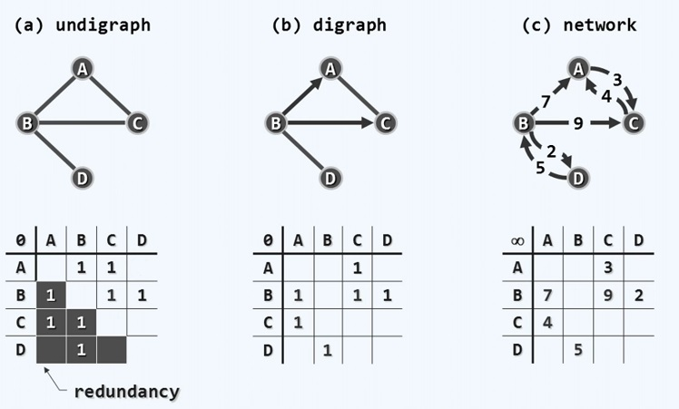

# 图

[清华大学 邓俊辉 《数据结构》](http://www.xuetangx.com/courses/TsinghuaX/30240184_1X/_/about)

## 概述

### 基本术语

G = (V; E)

vertex: n = |V|

edge|arc: e = |E|

#### 邻接和关联

adjacency 邻接关系 顶点与定点

incidence 关联关系 顶点与其相关的边

树结构可以视为图的一种特殊形式

#### 有向和无向

若邻接定点 u 和 v 的次序无所谓，则 (u, v) 为无向边，所有边均无方向的图为为无向图

有向图中均为有向边，u、v分别称作边 (u, v) 的尾、头

含有有向边和无向边的图为混合图

可以将无向边转化为彼此对称的一对有向边。

#### 路径和环路

路径：
长度： 
简单路径：不含重复节点的路径
环路：
简单环路：不包含重复节点的环路

在一个有向图中不包含任何环路，称之为有向无环图 (DAG)

欧拉环路(Eulerian tour )：经过所有的边且恰好一次的环路

哈密尔顿环路(Hamiltonian tour)：恰好经过每个定点一次的环路

## 邻接矩阵

### 接口

定义 Graph 模板类

```C++
template <typename Tv,  typename Te> class Graph //定点类型，边类型
{
private:
    void reset() //所有定点、边的辅助信息复位
    {
        for (int i = 0; i < n; i++) //定点
        {
            status(i) = UNDISCOVERED;
            dTime(i) = fTime(i) = -1;
            parent(i) = -1;
            priority(i) = INT_MAX;
            for (int j = 0; j < n; j++)//边
            {
                if (exisits(i,j))
                    status(i,j) = UNDETERMINED;
            }
        }
    }
public:
    /* ...顶点操作、边操作、图算法：无论如何实现，接口必须统一... */
} // Graph
```

### 邻接矩阵与关联矩阵

邻接矩阵：描述定点相互邻接关系的矩阵

n 行 n 列，矩阵中第 i 行与第 j 列的元素表示定点 i 和定点 j 是否存在一条边。无向图则为对称矩阵。若为带权图，可以将权重存入矩阵

关联矩阵

n 行 e 列，存在关联关系，记作 1，否则记作 0，对于矩阵中任意一列，应该恰好只有两个单元的数值为1

默认值放在左上角



### 顶点和边

```C++
typedef enum { UNDISCOVERED, DISCOVERED, VISITED } VStatus;
template <typename Tv> struct Vertex //顶点对象（并未严格封装）
{
    Tv data; int inDegree, outDegree; // 数据，出入度数
    Vstatus status; // 如上三种状态
    int dTime, fTime; // 时间标签：发现和访问完毕的时刻
    int parent; // 在遍历树中的父节点
    int priority; // 在遍历树中的优先级（最短通路、极短跨边等）
    Vertex( Tv const & d) : // 构造新顶点
    	data(d), inDegree(0), outDegree(0), status(UNDISCOVERED),
    	dTime(-1), fTime(-1), parent(-1),
    	priority(INT_MAX) {}
}

typedef  enum {UNDETERMINED, TREE, DROSS, FORWARD, BACKWARD} EStatus;
template <typename Te> struct Edge //边对象（并未严格封装）
{
    Te data; // 数据
    int weight; //权重
    EStatus status; //类型
    Edge (Te const & d, int w): //构造新边
    	data(d), weight(w), status(UNDETERMINED){}
}
```

### 邻接矩阵 GraphMatrix

```C++
template <typename Tv, typename Te> class GraphMatrix : public Graph <Tv, Te>
{
private:
	Vector < Vertex<Tv> > V; //顶点集
	Vector < Vector< Edge<Te>* > > E; //边集
public:
	/*接口操作：顶点相关、边相关、...*/
	GraphMatrix() { n = e = 0;} //构造
    ~GraphMatrix() // 析构
    {
    	for (int j = 0; j < n; j++)
    		for (int k = 0; k < n; k++)
    			delete E[j][k] // 清除所有动态申请的边记录
    }
};
```

### 顶点操作

```C++
Tv & vertex(int i) {return V[i].data;} // 数据
int inDegree(int i) {return V[i].inDegree;} // 入度
int outDegree(int i) {return V[i].outDegree;} // 出度
Vstatus & stauts(int i) {return V[i].status;} // 状态
int & dTime(int i) {return V[i].dTime;} // 时间标签dTime
int & fTime(int i) {return V[i].ftime;} // 时间标签fTime
int & parent(int i) {return V[i].parent;} // 在遍历树中的父亲
int & priority(int i) {return V[i].priority;} // 优先级数
```

对于任意顶点 i，枚举其所有的邻接顶点 neighbour

```C++
int nextNbr(int i, int j)// 若已枚举至邻居j，则转向下一邻居
{    
    while((-1<j) && !exists(i,--j)); // 逆向顺序查找，O(n)
	return j;
}// 改用邻接表可提高至O(1+outDegree(i))
int firstNbr(int i)
{
    nextNbr(i,n);
}// 首个邻居
```

### 边操作

```C++
bool exists(int i, int j)//判断边i,j是否存在
{
    return (0 <= i) && (i < n) && (0 <= j) && (j < n) && e[i][j]!=NULL; //短路求值
} //以下假定exists(i,j)...
Te & edge(int i, int j)//边(i,j)的数据
{
    return e[i][j]->data;
}// O(1)
Estatus & status(int i, int j) // 边(i,j)的状态
{
    return e[i][j]->status;
}// O(1)
int & weight(int i, int j) //边(i,j)的权重
{
    return E[i][j]->weight;
}// O(1)
```

#### 边插入

将边 (i,j) 封装为一个新的边记录，将其地址存入邻接矩阵

```c++
void insert(Te const& edge, int w, int i, int j)//插入(i,j,w)
{
    if (exists(i,j)) return; //忽略已有的边
    e[i][j] = new Edge<Te>(edge,w); //创建新边
    e++; //更新边技术
    V[i].outDegree++; //更新关联顶点i的出度
    V[j].inDegree++; //更新关联顶点j的入度
}
```

#### 边删除

将矩阵中对应边的记录释放，指针置为空

```C++
Te remove(int i, int j)// 删除顶点i和j之间的联边(exists(i,j))
{
    Te eBak = edge(i, j); // 备份边(i,j)的信息
    delete E[i][j]; E[i][j] = NULL; // 删除边(i, j)
    e--; // 更新边计数
    V[i].outDegree--; //更新关联顶点i的出度
    V[j].outDegree--; //更新关联顶点j的入度
    return eBak; // 返回被删除边的信息
}
```

### 顶点动态操作

#### 增加顶点

```C++
int insert(Tv const & vertex) // 插入顶点，返回编号
{
    for (int j = 0; j < n; j++) // 每一个行向量的尾部增加一个初始为空的单位
        E[j].insert(NULL);
    n++;
    E.insert(Vector < Edge<Te>* > (n, n, NULL)); // 生成一个行向量，
    return V.insert(Vertex<Tv>(vertex));
    
}
```

#### 删除顶点

```C++
Tv remove(int i) // 删除顶点及其关联边，返回该顶点信息
{
    for (int j = 0; j < n; j++)
        if (exists(i, j)) // 删除所有出边
        {
            delete E[i][j];
            V[j].inDegree--;
        }
    E.remove(i);
    n--;// 删除第i行
    for (int j = 0; j < n; j++)
        if (exists(j,i)) // 删除所有入边及第i列
        {
            delete E[j].remove(i);
            V[j].outDegree--;
        }
    Tv vBak = vertex(i); // 备份顶点i的信息
    V.remove(i);// 删除顶点i
    return vBak; //返回被删除顶点的信息
}
```

## 广度优先搜索

思路：化繁为简

自始顶点 s 的广度优先搜索(Breadth-First_Search)

访问顶点 s

依次访问 s 所有**尚未访问**的邻接顶点

依次访问它们**尚未访问**的邻接顶点

...

如此反复，直至没有**尚未访问**的邻接顶点

可视为树的层次遍历

```C++
//Graph::BFS()
template <typename Tv, typename Te> // 顶点类型，边类型
void Graph<Tv, Te>::BFS(int v, int & clock)
{
    Queue<int> Q; // 初始化
    status(v) = DISCOVERED;
    Q.enqueue(v);
    
    while (!Q.empty())
    {
        int v = Q.dequeue();
        dTime(v) = ++clock; //取出队首顶点v，并考察v的每一邻居u
        for (int u = firstNbr(v); -1 < u; u = nextNbr(v, u))
            /* ...视u的状态，分别处理... */
        {
            if (UNDISCOVERED == status(u)) //若u尚未被发现，则
            {
                status (u) = DISCOVERED; // 发现该顶点
                Q.enqueue u;
                status (v,u) = TREE;
                parent(u) = v; // 引入树边
            }
            else // 若u已被发现（正在队列中），或甚至已经访问完毕（已出队列），则
            {
                status(u, v) = CROSS; // 将(u, v)归类于跨边
            }
        }
        status(v) = VISITED; //至此，当前顶点访问完毕。
    }
}
```

### 多连通

```C++
template <typename Tv, typename Te> // 顶点类型，边类型
void Graph<Tv, Te>::bfs(int s) //s为起始顶点
{
    reset(); int clock = 0; int v = s; // 初始化 \Theta(n+e)
    do //逐一检查所有顶点，一旦遇到尚未发现的顶点
    {
        if (UNDISCOVERED == status(v)) // 累计 \Theta(n)
            BFS (v, clock); //即从该顶点出发启动一次BFS
    }while （s != (v = (++v % n)));
    // 按序号访问，故不重不漏
}//无论共有多少联通/可达分量
```

Graph::DFS

外部：while循环执行O(n)

内部：for循环本身 n*n 内层循环实际操作e次

理论上渐进$ O(n^2) $ ，实际中远远不是这样。连续、规则、紧凑的组织形式利于高速缓冲机制发挥作用，存储级别之间巨大的速度差异在实际应用中往往更为举足轻重。因此，实际中可以将n忽略掉，近似为O(n+e)，若使用邻接表，则为O(n+e)

## 深度优先搜索

DFS(s)：始自顶点 s 的深度优先搜索

访问顶点 s

若 s 尚有未被访问的邻居，则任取其一 u，递归执行 DFS(u)

否则，返回

得到一颗DFS树

```C++
template <typename Tv, typename Te> //顶点类型、边类型
void Graph<Tv, Te>::DFS(int v, int & clock)
{
    dTime(v) = ++clocl; status(v) = DISCOVERED; // 发现当前顶点v
    for (int u = firstNbr(v); -1 < u; u = nextNbr(v,u)) // 枚举v的每一邻居u
        /*...视u的状态，分别处理...*/
        /*...与BFS不同，含有递归...*/
    {
        switch(status(u))
        {
            case UNDISCOVERED: //u 尚未发现，意味着之成熟可在此拓展
        		status(v, u) = TREE; parent(u) = v; DFS(u, clock); break; //递归
            case DISCOVERED: // u已被发现但尚未访问完毕，应属被后代指向的祖先
                status(v, u) = BACKWROD; break;
            default: // u已访问完毕（VISITED，有向图），则视承袭关系分为前向或跨边
                status(v, u) = dTime(v) < dTime(u) ? FORWARD : CROSS; break;
        }
        
    }
    status(v) = VISITED; fTime(v) = ++clock; //至此，当前顶点v方告访问完毕
}
```

### 多可达域

类似 BFS 的处理方法，在外层添加循环

#### 括号引理/嵌套引理

顶点的活动期：`active[u] = (dTime[u], fTime[u])`

Parenthesis Lemm：给定有向图 G = (V, E) 及其任一 DFS 森林，则

- u 是 v 的后代 iff active[u]为 active[v] 的子集
- u 是 v 的祖先 iff active[u] 为 active[v] 的子集
- u 与 v 无关 iff active[u] 与 active[v] 的交际为空集

