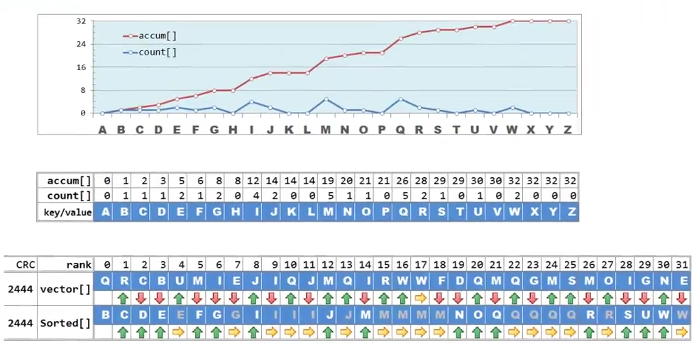

# 词典

[清华大学 邓俊辉 数据结构](http://www.xuetangx.com/courses/course-v1:TsinghuaX+30240184_2X+sp/about)

## 散列：原理

循数值访问

桶(bucket)：直接存放或间接指向一个词条

桶数组(bucket array)/散列表(hash table)，容量为M，关键码空间 R，N < M << R，M= θ(n)

空间 = O(N+M) = O(N)

定址/杂凑/散列：根据词条的 key（未必可比较）直接确定散列表入口

散列函数：hash()：key ==> %entry

### 冲突

key1 != key2，hash(key1) = hash(key2)

## 散列函数

散列函数 hash(): S==>A 不可能是单射

词条空间 S ~ 可能的词条

地址空间 A ~ 散列表

|S| = R >> M = |A|

近似地单射往往可行。

发生冲突时可以排解。

### 评价标准与设计原则

1. 确定性：同一关键码总是被映射至同一地址
2. 快速：expected-O(1)
3. 满射：尽可能充分地覆盖整个散列空间
4. 均匀：关键码映射到散列表各位置地概率尽量接近，可有效避免聚集（clustering）现象

### 除余法

hash(key) = key % M

#### M 的选择

##### 若 M = 2^k

其效果相当于截取 key 的最后 k 位，前面的 n-k 位对地址没有影响。

key % M = key & (M - 1)

不满足均匀性

推论：当且仅当最后 k 位相同，发生冲突 // 发生冲突的概率大

##### M 为素数

对散列表的覆盖最充分，分布最均匀

设数据序列步长为S, 考察 S 和 M 的最大公因子 gcd(S, M) = G

当且仅当 G = 1 时，数据序列能够遍布整个散列表。因此 M 应为素数。

#### 缺陷

1. 不动点：不论表长 M 取值如何，总有hash(0) = 0
2. 零阶均匀：[0, R)的关键码，平均分配至 M 个桶，但相邻关键码的散列地址也必相邻

一阶均匀：邻近的关键码，散列地址不再邻近。

### MAD法

MAD = multiply-add-divide

取 M 为素数，a > 0，b > 0，a % M != 0

hash(key) = ( a * key + b) % M

a 相当于步长，b 相当于偏移量

### 更多散列函数

#### 数字分析

抽取 key 中的某几位，构成地址，比如，取十进制表示的奇数位

hash (123456789) = 13579

#### 平方取中

取 key^2 的中间若干位，构成地址

例如

hash (123) = 512 // 保留 key^2 = 1 512 9 的中间 3 位

hash (1234567) = 556 // 1524 556 77489

取中间的若干位可以使原关键码的影响对最终地址的影响彼此更为接近。

#### 折叠法

将 key 分割成等宽的若干段，取其总和作为地址

hash (123 456 789) = 1368 // 123 + 456 + 789，自左向右

hash (123 456 789) = 1566 // 123 + 654 + 789，往复折返

#### 位异或法

将 key 分割成等宽的二进制段，经异或运算得到地址

hash (110 011 011) = 110 // 110 ^ 011 ^ 011，自左向右

hash (110 011 011) = 011 // 110 ^ 110 ^ 011，往复折返

散列函数越是随机，越没有规律，越好。

#### 伪随机数法

循环：rand(x + 1) = [a * rand(x)] % M

hash(key) = rand(key) = [rand(0) * a^key] % M

种子：rand(0) = ?

伪随机数发生器的实现，因具体平台、不同历史版本而异，创建的散列表可移植性差，慎用

#### 多项式法

对于字符串

hash(s = x0 x1 ... xn) = x0 \*a^(n-1) + x1\* a^(n-2) + ... + x(n-2) \* a^1 + x(n-1) // O(n)

```C++
static size_t hashCode(char s[]) // 近似多项式，但更快捷 适用于英文字符串
{
    int h = 0;
    for (size_t n = strlen(s), i = 0; i < n; ++i)
    {
        h = (h << 5) | (h >> 27); // 将前端的 5 个比特和后端的 27 个比特互换位置 
                                  // 可视为近似的多项式计算
        h += (int) s[i];
    }
    return (size_t) h;
}
```

## 排解冲突

### 多槽位

multiple slots

桶单元细分位若干槽位（slot）存放（与同一单元）冲突的词条

只要槽位数目不多，依然可以保证 O(1) 的时间效率

缺点：每个桶分为多少个槽位无法预测，预留过多空间浪费，无论预留多少，极端情况下仍有可能不够。

### 独立链

linked-list chaining/ separate chaining

每个桶存放一个指针，冲突的词条组织成列表。

优点：无需为每个桶预备多个槽位，任意多次的冲突都可解决，删除操作实现简单、统一。

缺点：指针需要额外空间，节点需要动态申请，空间未必连续分布，系统缓存几乎失效。

### 开放定址

open addressing ~ closed hashing

为每个桶都事先约定若干备用桶，它们构成一个查找链 probing sequence/ chain

在连续的地址空间中，所有的桶按照优先级队列排列，每一个词条优先存储在它本该存放的桶中。

沿查找链，逐个转向下一桶单元，直到命中成功，或者抵达一个空桶（已遍历所有冲突的词条）失败。

#### 线性试探

Linear probing 一旦冲突，则试探后一紧邻桶单元；

[hash(key) + 1] % M

[hash(key) + 2] % M

...

直到命中成狗，或抵达空桶失败。

优点：无需附加的（指针、链表或溢出区等）空间，查找链具有局部性，可充分利用系统缓存，有效减少 I/O

缺点：操作时间 > O(1)，冲突增多——以往的冲突会导致后续的冲突。

#### 懒惰删除

按照开放定址策略：先后插入、相互冲突的一组词条，将存放于同一查找链中。

如果需要删除其中某一词条，直接删除，清除词条，回收空桶：

问题：查找链被切断，后续词条将丢失——明明存在，却访问不到。

需要 lazy remove：仅做删除标记，查找链不必续接

#### 平方试探

线性试探的缺陷在于，试探位置间距太近

以平方数为距离，确定下一试探桶单元

[hash(key) + 1^2] % M

[hash(key) + 2^2] % M

[hash(key) + 3^2] % M

数据聚集现象有所缓解

查找链上，各桶间距线性递增，一旦冲突，可聪明地跳离是非之地

代价：若涉及外存，I/O将激增。

有可能散列表中还有空桶，却不能被发现。

若 M 是素数，且装填因子 λ<=0.5，就一定能够找出空桶，否则不见得。

#### 双向平方试探

自冲突位置起，交替向前、向后试探

[hash(key) + 1^2] % M

[hash(key) - 1^2] % M

[hash(key) + 2^2] % M

[hash(key) - 2^2] % M

...

对双向平方试探，有些表长会导致两个方向查找的桶的位置一样。

对于 M%4=3 的素数，必然可以保证查找链的前 M 项互异。

##### 双平方定理

任一素数 p 可表示为一对整数的平方和，当且仅当 p%4 = 1

由 (u^2 + v^2)(s^2+ t^2) = (us + vt)^2 + (ut - vs)^2

任一自然数 n 可以表示为一对整数的平方和，当且仅当在其素数分解中，形如 M = 4 × k + 3 的每一素因子均为偶数次方

## 桶/计数排序

待排序元素个数 n，取值范围 M

O(n+M) O(max(n,M))

输入元素存在大量重复则有望在 O(n) 内完成排序

例如对英文字母排序，满足 M=26 << n

### 桶排序

26个字母，建立长为26的散列表，统计每个字母在序列中出现的次数 count，可以在 O(n) 内完成

相当于将每个元素扔到其对应的桶中。

accum: 包括当前字母在内，前面所有字母 count 的积分值，即前面所有字母个数的总和。给出了当前字母在有序序列中对应的位置。

例如，字母 F 对应的积分值为6，个数为1，字母 G 对应的积分值为 8，个数为 2，在有序序列中F 应被放到 5，G应被放到 [6,8) 的位置。

因此，只要得到每个字母的统计值和累计值，就可以根据相邻两个字母的累计值确定它们在有序序列中的区间范围。



统计值可以在 O(n)中获得，累计值可以在O(m)中通过统计值获得。