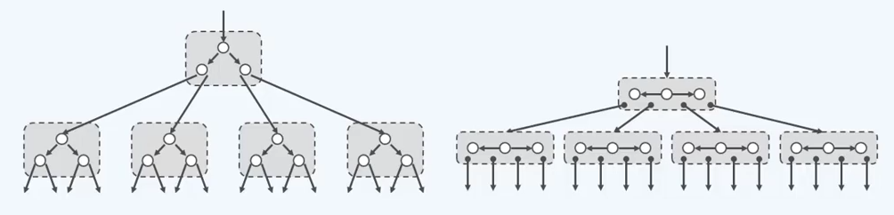

# 高级搜索树

[清华大学 邓俊辉 数据结构](http://www.xuetangx.com/courses/course-v1:TsinghuaX+30240184_2X+sp/about)

## B-树

### 动机

系统存储容量的增长速度 << 应用问题规模的增长速度

物理上，存储器的容量越大/小，访问速度就越慢/快

#### 高速缓存

不同容量的存储器，访问速度差异悬殊

以磁盘与内存为例：ms/ns > 10^5

若一次内存访问需要一秒，则一次外存访问就相当于一天

为避免一次外存访问，宁愿访问内存10次、100次……

从磁盘中读写 1B，与读写 1KB 几乎一样快

批量式访问：以页（page）或块（block）为单位，使用缓冲区

#### 分级IO

多数存储系统都是分级组织的——Caching

最常用的数据尽可能放在更高层，更小的存储器中，实在找不到，才向更低层、更大的存储器索取。

CPU < RAM < DISK < ARRAY < ...

### 结构

B 树：用来存放一组具有关键码的词条的数据结构

特点：每一个节点未必只有两个分支，可以拥有更多的分支；所有底层节点的深度完全一致（理想平衡）；相对于常规二叉查找树，B 树更宽、更矮

#### 多路平衡

B 树：一种平衡的多路（multi-way)搜索树

经适当合并，得到超级节点。

对二叉树，每两代做一次合并，父节点与子节点合并成一个超级节点

- 每 2 代合并：4 路
- 每 3 代合并：8 路
- ...
- 每 d 代合并：m=2^d 路，m - 1 个关键码

逻辑上与 BBST 完全等价



多级存储系统中使用 B-树，可针对外部查找，大大减少 I/O 次数

例如，若有 n = 1G 个记录，对于 AVL 树，每次查找需要 log(2, 10^9) = 30 次 I/O 操作，每次只读出一个关键码，得不偿失。B-树充分利用外存对批量访问的高效支持，将此特点转化为优点，每下降一层，都以超级节点为单位，读入一组关键码。具体多大一组，视磁盘的数据块大小而定。m = #keys / pg。目前多数数据库系统采用 m = 200 ~ 300。若取 m = 256, 则每次查找只需 log(256, 10^9) <= 4 次 I/O。

#### 定义

所谓 m 阶 B-树，即 m 路平衡搜索树（m>=2）。外部节点的深度统一相等，所有叶节点的深度统一相等。树高 h = 外部节点的深度。


erternal nodes：叶节点中数值为空，并不存在的孩子

#### 阶次的含义

对于内部节点

各有不超过 m-1 个关键码：K1<K2<...<Kn

不超过 m 个分支：A0，A1，A2,..., An

拥有 n 个关键码的节点对应着 n + 1 个分支

内部节点的分支树 n + 1 也不能太少，具体地，

树根 2 <= n + 1

其余 「m / 2] <= n + 1  (m/2向上取整)

故亦称作(「m/2],m)-树。例如（3，5）树，（2，4）树

#### 紧凑表示

完整表示：对于每一个关键码，为它的左右后代再它的左、右画出一个引用。所有外部节点位于同一层

紧凑表示：将引用简化成点。省略外部节点


#### BTNode

将每一个关键码 n 个节点和 n+1 个分支可以实现为两个向量

```C++
template <typename T> struct BTNode // B-树节点
{
    BTNodePosi(T) parent; // 父
    Vector<T> key; // 数值向量
    Vector <BTNodePosi(T)> child; //孩子向量（其长度总比 key 多 1）
    BTNode() { parent = NULL; child.insert(0, NULL);}
    BTNode(T e, BTNodePosi(T) lc = NULL, BTNodePosi(T) rc = NULL)
    {
        parent = NULL; // 作为根节点，且初始时
        key.insert(0, e); // 仅一个关键码，以及两个孩子
        child.insert(0, lc); child.insert(1, rc);
        if (lc) lc->parent = this; if(rc) rc->parent = this;
    }
}
```

### 查找

#### 算法过程

B-树只载入必需的节点，尽可能较少 I/O 操作。可以假设一棵 B-树的根节点常驻于内存。首先再常驻于内存的根节点中进行顺序查找。如果查找失败，通过该位置的引用找到下层的节点，载入内存，继续查找。若查找失败，则载入下一层的节点，继续查找，重复上述步骤，直至查找成功，或到达叶节点后查找失败，访问外部节点（可能失败，或该外部节点指向另一颗 B-树）。

```C++
template <typename T> BTNodePosi(T) BTree<T>::search(const T & e)
{
    BTNodePosi(T) v = _root; _hot = NULL; // 从根节点出发
    while (v) // 逐层查找
    {
    	Rank r = v->key.search(e); // 再当前节点对应的向量中顺序查找，返回不大于查找结点的最大节点
        if (0 <= r && e == v->key[r]) return v; // 若成功，则返回； 否则
        _hot = v; v = v->chlid[r+1]; // 沿引用转至对应的下层子树，并载入其根 I/O
    } // 若因 !v 而退出，则意味着抵达外部节点
    return NULL; // 失败
}
```

#### 复杂度

影响效率的因素：树高渐进 O(logn)、I/O 操作、节点内部的顺序查找

#### 最大高度

含 N 个关键码的 m 阶 B-树，高度从0开始，到叶子节点为第 h - 1 层，外部节点为第 h 层

为此，内部节点应尽可能”瘦“，每个关键码的分支数都取下界，各层节点数依次为

- n0 = 1, n1 = 2, n2 = 2*[m/2],...
- nk = 2 * [m/2]^(k-1)

考察外部节点所在层（第 h 层）

- N + 1 = nh >= 2 * ([m/2])^(h-1)
- h <= 1 + log_([m/2])[(n+1)/2] = O(log_m^n)  [m/2]向下取整，[n+1]向上取整

N 个内部节点（成功可能），N+1 个外部节点（失败可能）

相对于 BBST，log_([m/2])(n/2) / log_2 N = 1/(log_2(m-1))

若取 m = 256, 数高（I/O次数）约降低至 1/7

#### 最小高度

含 N 个关键码的 m 阶 B-树

求最小数高，为此，内部节点应尽可能”胖“

各层内部节点数依次为

n0 = 1, n1 = m, n2 = m^2, n3 = m^3, ..., n_(h-1) = m^(h-1), n_h = m^h

对于外部节点所在层，N + 1 = n_h <= m^h

h >= log_m(N + 1) = Ω(log_m N)

相对于 BBST ：log_m (N-1)/log_2 N = log_m 2 - log_N 2 = 1/log_2 m

若取 m = 256，数高（I/O 次数）约降低至 1/8

因此，关键码总数不变时，B-数的高度变化范围不大

### 插入

#### 算法框架

```C++
template <typename T>
bool BTree<T>::insert(const T & e)
{
    BTNodePosi(T) v = search(e);
    if (v) return false; // 确认 e 不存在
    Rank r = _hot->key.search(e); // 在节点_hot中确定插入位置
    _hot->key.insert(r+1, e); // 将新关键码插至对应的位置
    _hot->child.insert(r+2, NULL); // 创建一个空子树指针
    _size++; solveOverflow(_hot); // 如果发生上溢，需做分裂
    return true; // 插入成功
}
```

#### 分裂

设上溢节点中的关键码依次为 k0, ...,k(m-1)，取中位数s = [m/2] (向下取整)，以关键码 ks 为界划分为

k0, ..., k(s-1), ks, k(s+1), ...,k(m-1)，关键码 ks 提升一层，并分裂（split）：以所得的两个节点作为左、右孩子。

等效于在父节点中插入一个关键码，父节点可能发生上溢，继续对父节点进行分裂。上溢可能持续发生，并逐层向上传播且只会逐层向上；最坏情况亦不过倒根。

> 中位数：在向量中，就是秩居中的元素，亦即，A[0,n) 中的 A[n/2] (n/2向下取整)
>
> 比如 A[0,5) 中的 A[2]

##### 分裂到根

根节点分裂时，将中位数作为新的根节点，这是导致 B-树增高的唯一情况。

每一层最多一次分裂，需要时间 O(1)*h = O(h)

### 删除

#### 算法框架

```C++
template <typename T>
bool BTree<T>::remove(const T & e)
{
    BTNodePosi(T) v = search(e);
    if (!v) return false; // 确认 e 存在
    Rank r = v->key.search(e); // 确定 e 在 v 中的秩
    if （v-child[0]） // 若 v 非叶子，则
    {
        BTNodePosi(T) u = v->child[r + 1]; // 在右子树中一直向左，即可
        while (u->child[0]) u = u->child[0]; // 找到 e 的后继（必属于某叶节点）
        v->key[r] = u->key[0]; v = u; r = 0; // 并与之交换位置
    } // 至此，v 必然位于最底层，且其中第 r 个关键码就是待删除者
    v->key.remove(r); v->child.remove(r + 1); _size--;
    solveUnderflow(v); return true; // 如有必要，需做旋转或合并
}
```

#### 旋转

若节点 v 下溢，必恰好包含 [m/2]-2 个关键码 + [m/2]-1 个分支（m/2向上取整）


当另一侧分支减去一个元素不会导致下溢时，向父节点借一个关键码，从另一侧分支拿出最后的一个关键码还给父节点，这样可以在保证顺序性的前提下完成旋转。

#### 合并

当发生下溢的节点左或右兄弟不存在，或者所含关键码均不足 [m/2] 个 （m/2 向上取整）注意，L 和 R 仍必右其一，且恰含 [m/2]-1 个关键码（m/2 向上取整）


父节点可能进一步发生下溢，如法炮制，O(h)

合并时使 B-树高度减小的唯一可能。

