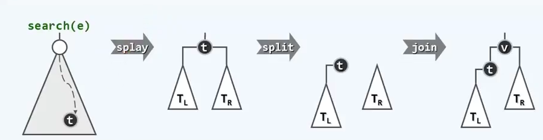

# 高级搜索树

## 伸展树

### 逐层伸展

#### 局部性

Locality：刚被访问过的数据，极有可能很快地再次被访问

BST：刚刚被访问过的节点，极有可能很快地再次被访问，下一将要访问的节点，极有可能就在刚被访问的节点附近

连续的 m 次查找 (m >> n = |BST|)，采用 AVL 共需要O(mlogn) 时间

#### 自适应调整

以列表为例，一旦某个元素被访问，则将该元素放到列表的最前端

#### 逐层伸展

节点 v 一旦被访问，随即转移至树根：使用 zig 和 zag 进行旋转

自下而上，逐层单旋

#### 最坏情况


从 001 到 007 按顺序逐个访问。树的规模为 n, 则访问第一个节点需要 n，第二个 n-1……最后一个 1

旋转次数呈周期性的算术级数演变：每一周期累计 Ω(n^2)，分摊 Ω(n)

### 双层伸展

向上追溯两层，而非一层

反复考察祖孙三代：g=parent(p)，p=parent(v)，v，根据它们的相对位置，经两次旋转使得 v 上升两层，称为（子）树根

#### 子孙异侧（zig-zag/zag-zig)

与 AVL 树双旋完全等效，与逐层伸展别无二致

#### 子孙同侧（zig-zig/zag-zag)


先从 g 开始旋转，最终的拓扑结构略有不同

在最坏情况下，双层伸展每次所得的树高比逐层伸展所得的树高要小，树高缩减到约为原来的一半，树的形态得到有效的优化。再次访问最深的节点，树的结构会得到进一步优化。

#### 分摊性能

折叠效果：一旦访问坏节点，对应路径的长度将随即减半

最坏情况不致持续发生。单趟伸展操作分摊 O(logn) 时间。


如果 v 只有父亲，没有祖父

此时必有 parent(v) == root(T)，且每轮调整中，这种情况至多（在最后）出现一次。

视具体情况做单次旋转：zig(r) 或 zag(r)

### 算法实现

#### 功能接口

```C++
template <typename T>
class Splay: public BST<T> // 由 BST 派生
{
protected: BinNodePosi(T) splay(BinNodePosi(T) v); //将 v 伸展至根
public: // 伸展树的查找也会引起整棵树的结构调整，故 search() 也需重写
    BinNodePosi(T) & search( const T & e); // 查找
    BinNodePosi(T) insert (const T & e); // 插入
    bool remove(const T & e); // 删除
}
```

#### 伸展算法

```C++
template <typename T> BinNodePosi(T) Splay<T>::splay(BinNodePosi(T) v)
{
    if (!v) return NULL; BinNodePosi(T) p; BinNodePosi(T) g; // 父亲、祖父
    while ((p=v->parent) && (g = p->parent)) // 自下而上，反复双层伸展
    {
        BinNodePosi(T) gg = g->parent; // 每轮之后，v 都将以原曾祖父为父
        if (IsLChild(*v))
            if (IsLChild(*p)) 
            {
                /* zig-zig*/
                attachAsLChild(g, p->rc);
                attachAsLChild(p, v->rc);
                attachAsRChild(p, g);
                attachAsRChild(v, p);
            } 
        	else 
            {
                /* zig-zag */
            }
        else if (IsRChild(*p)) 
        	{
            	/* zag-zag */
        	} 
        	else 
            {
                /* zag-zig */
            }
        if (!gg) v->parent = NULL; // 若无曾祖父 gg，则 v 现即为树根；
                                   //否则，gg此后应以 v 为左或右孩子
        else (g == gg->lc)? attachAsLChild(gg, v) : attachAsRChild(gg,v);
    } // 双层伸展结束时，必有 g==NULL，但 p 可能非空
    if (p = v->parent) {/* 若 p 果真是根，只需再额外单旋（至多一次）*/}
    v->parent = NULL; return v; // 伸展完成，v抵达树根
}
```

#### 查找算法

```C++
template <typename T> BinNodePosi(T) & Splay<T>::search(const T & e)
{
    // 调用标准BST的内部接口定位目标节点
    BinNodePosi(T) p = searchIn( _root, e, _hot = NULL);
    // 无论成功与否，最后被访问的节点将伸展至根
    _root = splay(p ? p : _hot); // 成功、失败
    // 总是返回根节点
    return _root;
}
```

伸展树的查找操作，与常规 BST::search() 不同，很可能会改变树的拓扑结构，不再属于静态操作。

#### 插入算法

直观方法：调用BST标准的插入算法，再将新节点扩展至根，其中，首先需调用 BST::search()

重写后的 Splay::search() 已集成了 splay() 操作，查找（失败）之后，_hot 即是根节点



#### 删除算法

直观方法：调用 BST 标准的删除算法， 再将_hot延申至根

同样的，Splay::search() 查找（成功）之后，目标节点即是树根，可以再树根附近完成目标节点的摘除

找到需要删除的节点，伸展至树根，删除节点，寻找右子树中最小元素（沿左子树找到最小节点）作为根节点连接左右子树


#### 综合评价

##### 优点

无需记录节点高度或平衡因子：编程实现简单易行，由于 AVL 树

分摊复杂度 O(logn) 与 AVL 树相当

局部性强，缓存命中率极高（即 k << n << m)

效率甚至可以更高——自适应的 O(logk)

任何连续的 m 次查找，都可在 O(mlogk + nlogn) 时间内完成

##### 缺点

仍不能保证单次最坏情况的出现

不适用于对于效率敏感的场合

