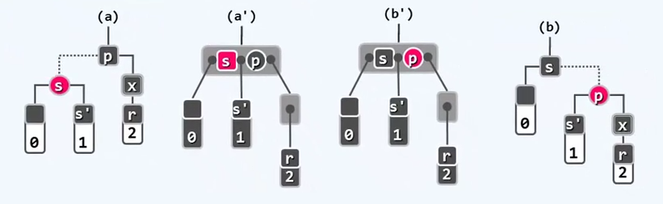

# 高级搜索树

[清华大学 邓俊辉 数据结构](http://www.xuetangx.com/courses/course-v1:TsinghuaX+30240184_2X+sp/about)

## 红黑树

节点可能是红色，也可能是黑色。

### 动机

#### 一致性结构

Persistent structure: 支持对历史版本的访问

例如：每个版本独立保存；各版本入口自成一个搜索结构，单次操作 O(logh+logn)，累计 O(h*n) 时间/空间

h =   |history|

复杂度控制在 O(n + h*logn)：需要同一数据结构相邻版本之间的关联性

#### 关联性

大量共享，少量更新：每个版本的新增复杂度，仅为 O(logn)

#### O(1)重构

就树形结构的拓扑而言，相邻版本之间的差异不能超过 O(1)

任何一次动态操作引发的结构变化量不致超过 O(1)

### 结构

#### 定义规则

由红、黑两类节点组成的BST //亦可给边染色

（增设外部节点NULL，保证红黑树为真二叉树。）

1. 树根：必为黑色
2. 外部节点：均为黑色
3. 其余节点：若为红，则只能有黑孩子 // 红之子，之父必黑
4. 外部节点到根：途中黑节点数目相等 // 黑深度

#### 提升变换

将每一个红色节点提升，与它的父亲平级，提升之后，所有底层节点高度相同。

提升之后的每棵红黑树都对应于一棵 (2,4) 树。

将黑节点与其红孩子视作（关键码合并为）超级节点，无非 4 种组合，分别对应 4 阶 B-树的一类内部节点


#### 平衡性

红黑树属于 BBST

由等价性，既然 B-树是平衡的，红黑树自然也是平衡的。

定理：包含 n 个内部节点的红黑树 T，高度 h = O(logn) 且拥有 n+1 个外部节点

log_2 (n+1) <= h <= 2*log_2 (n+1)

若 T 高度为 h，黑高度为 H，则 h=R+H <= 2H

若 T 所对应的 B-树为 TB，则 H 即是 TB 的高度。TB 的每个节点，包含且仅包含 T 的一个黑节点。

于是 H <= log_[4/2] (n+1)/2 + 1 <= log_2 (n+1)，[4/2] 向上取整

#### 接口定义

```C++
template <typename T> class RedBlack: public BST <T> // 红黑树
{
public: // BST::search() 等其余接口可直接沿用
    BinNodePosi(T) insert( const T & e); // 插入（重写）
    bool remove(const T & e); // 删除（重写）
protected：
    void solveDoubleRed(BinNodePosi(T) x); //双红修正
    void solveDoubleBlack(BinNodePosi(T) x); //双黑修正
    int updateHdight(BinNodePosi(T) x); //更新节点x的高度（黑高度）
}；
template <typename T> int RedBlack<T>::updateHeight(BinNodePosi(T) x)
{
    x->height = max(stature(x->lc), stature(x->rc));
    if (IsBlack(x)) x->height++; return x->height; // 只计黑节点
}
```

### 插入

#### 双红缺陷

拟插入关键码 e，//不妨设 T 中本不 e

按 BST 的常规算法，插入之，// x = insert(e) 必为末端节点

不妨设 x 的父亲 p = x->parent 存在 // 否则， 即平凡的首次插入

将 x 染红（除非它是根） // x->color = isRoot(x) ? B : R

条件 1、2、4 依然满足；但 3 不一定满足，因为不确定 x 的父节点是否为红色

可能导致双红缺陷 // p->color == x->color == R

考察：x 的祖父 g = p->parent // g != null && g->color == B

p 的兄弟 u = p == g->lc ? g->rc : g-> lc // 即x的叔父

视 u 的颜色，分两种情况处理。

#### 算法框架

```C++
template <typename T> BinNodePosi(T) RedBlack <T>::insert(const T & e)
{
    // 确认目标节点不存在（留意对 _hot 的设置）
    BinNodePosi(T) & x = search(e);
    if (x) return x;
    // 创建红节点 x，以 _hot 为父，黑高度 -1
    x = new BinNode<T>(e, _hot, NULL, NULL -1); _size++;
    // 如有需要，需做双红修正
    solveDoubleRed(x);
    // 返回插入的节点
    return x? x: _hot->parent;
} // 无论原树种是否存有 e，返回时中有 x->data == e
```

##### RR-1

u->color == B

此时，x、p、g的四个孩子（可能是外部节点）全为黑，且黑高度相同。

另外两种情况与 a b 对称


(a') 交换 p g 的颜色  (b')交换 x g 的颜色

参照 AVL 树算法，做局部 3+4 重构，将节点 x、p、g 及其四棵子树，按中序组合为：

T0 < a < T1 < b < T2 < c < T3

染色：b 转黑，a 或 c 转红

从 B-树的角度，双红缺陷之所以非法，是因为

1. 在某个三叉节点种插入红关键码，使得原黑关键码不再居中 // RRB 或 BRR，出现相邻的红关键码
2.  调整之后的效果相当于（拓扑结构不变）在新的四叉节点中，三个关键码的颜色改为 RBR

O(1)

##### RR-2

u->color == R


在 B-树中，等效于超级节点发生上溢。

另外两种情况与 a b 对称

p 与 u 转黑，g 转红

在 B-树种，等效于节点分裂，关键码 g 上升一层

染色次数可能高达 O(logn) ，但拓扑结构变化控制在O(1)

#### 复杂度

重构、染色均属常数时间的局部操作，故只需统计其总次数

红黑树的每一次插入操作都可在 O(logn) 时间内完成。其中至多做 O(logn) 次节点染色，一次 3+4 重构。

| 情况 | 旋转次数 | 染色次数 | 此后 |
|--|--|--|--|
|u 为黑| 1~2| 2| 调整随即完成|
|u 为红| 0 | 3| 可能再次双红，但必上升**两**层|


### 删除

#### 算法框架

首先按照 BST 常规算法，执行： r = removeAt(x, _hot)

x 由孩子 r 接替 // 另一孩子记作 w （即黑的NULL）

条件 1 和 2 仍然满足，但 3 和 4 不见得满足。（不能保证红色节点的父节点为黑色，黑色节点的数目可能改变）

若二者之一为红，则 3 和 4 不难满足 // (只需将 r 染成黑色）删除遂告完成


若 x 和 r 均为黑色 (double black) 则 黑色节点长度必然缩短一位，全树黑深度不再统一，原 B-树x中所属节点下溢。

在新树中，考察 r 的父亲 p = r->parent //亦即原树中 x 的父亲

r 的兄弟 s = r  == p->lc ? p->rc : p->lc 

分为四种情况。

##### BB-1

s 为黑，且至少有一个红孩子 t

3 + 4 重构，t、s、p重命名为 a、b、c，r 保持黑；a 和 c 染黑，b 继承 p 的原色。


如此，红黑树性质在全局得以恢复，删除完成

在对应的 B-树中，以上操作等效于旋转，消除超级节点的下溢。

##### BB-2

s 为黑，且两个孩子均为黑，p 为红

r 保持黑；s 转红； p 转黑

在 B-树种，等效于下溢节点与兄弟合并。

红黑树的性质在全局得以恢复，上层节点不会继续下溢，因为合并之前在p之左或右侧还应有且仅有一个黑色关键码。


##### BB-2B

s 为黑，且两个孩子均为黑，p 为黑

s 转红，r 与 p 保持黑。

依然会发生下溢，通过合并解决，下层下溢引发上层下溢 O(logn)

经过重构操作红黑树的拓扑结构并没有发生实质性的变化，整个调整过程不超过常数的要求依然有可能落实


##### BB-3

s 为红，其孩子均为黑

s 、p 互换颜色

黑高度依然一场，但 r 有了一个新的黑兄弟 s'，转化为 BB-1 或 BB-2R

再经过一轮调整，红黑树性质必然全局恢复。



### 总结


红黑树的每一删除操作都可在O(logn)时间内完成。

其中，至多做 O(logn) 次重染色，一次 3 + 4 重构，一次单旋。